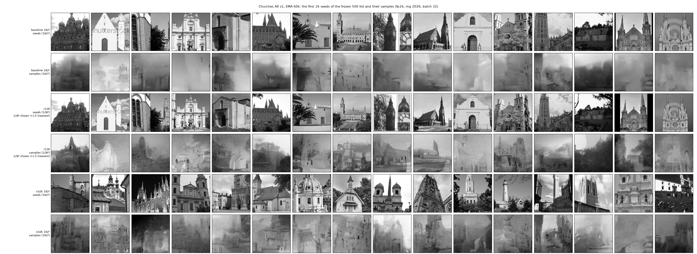

# Photograph-failure diagnostic (T7.3, M7, post hoc)

**Question** (`docs/SPECIFICATIONS/M7-diagnostics/README.md`, question 1): why do the photograph
models fail at 192²? Each diagnostic run changes one factor of the Churches A0 seed-1 run:

| role | run | change from the baseline |
|---|---|---|
| baseline | `lsun_church_A0_s1` (`fscratch/runs/ihdm/`) | none (192² native centre crops, 3,200 train) |
| r128 | `lsun_church_r128_A0_s1` (`fscratch/runs/ihdm_diag/`) | 128², whole-scene resize of the same 4,000 photos; σ_B,max = 64 |
| n32k | `lsun_church_n32k_A0_s1` (`fscratch/runs/ihdm_diag/`) | 32,000 train images (192² native crops); same `ref` and `seed` |

**Protocol (pre-registered on 2026-10-01, before any diagnostic run existed).** Each run is
evaluated at checkpoints 45,000, 50,000, 55,000 and 60,000 (EMA weights) on one A100. At each
checkpoint the sampler draws 500 training-seeded samples from the dataset's frozen
`eval_seeds_500.npy` list, with rng seed 2026, sample batch 32, fp16 autocast and the default δ
(1.25σ). The metrics compare these samples with the run's own 800-image `ref` split:

- KID with its 95% bootstrap interval, FID, precision, recall, density and coverage (Inception,
  k = 5);
- LSD, octave profile and variance ratio, on the W rule of `05-metrics.md`;
- M and the seed-NN fraction.

The late-window value of a quantity is its mean over the four checkpoints. The command is
`python -m ihdm.cli.evaluate_run --ckpts 45000,50000,55000,60000 --inception-steps
45000,50000,55000,60000 --amp fp16 --final-from-lsd --sample-batch 32 --n-seeds 40
--n-per-seed 5` (`slurm/diag_eval/photo_eval.sbatch`). The held-out set (40 × 5) is drawn only
because the final path always draws it; the reading does not use it.

**Rule.** A factor *lifts the failure* if its late-window precision is ≥ 0.10 **and** ≥ 10× the
baseline's, **and** its late-window KID (point estimate) is ≤ 0.5× the baseline's.

**Not comparable with table 1a.** These Inception metrics are computed on the 500-seed LSD set of
each checkpoint, not on the 2,000-seed production final set. The baseline's precision at 60k is
0.014 here and 0.005 in production; its KID is 0.244 here and 0.246 in production. Only the
comparisons inside this folder are like for like.

## Reproduction anchor

The baseline's LSD at each late checkpoint must equal the production evaluation
(`~/execs/ihdm/eval/lsun_church_A0_s1_amp-fp16_summary.json`) within 0.003. It does to every digit
`write_json` keeps:

| step | production | reproduced | difference |
|---|---|---|---|
| 45k | 1.42166 | 1.42166 | 0.0 |
| 50k | 1.36797 | 1.36797 | 0.0 |
| 55k | 1.36529 | 1.36529 | 0.0 |
| 60k | 1.44537 | 1.44537 | 0.0 |

## Results per run × checkpoint

| run | step | KID [95% CI] | FID | precision | recall | density | coverage | LSD | var. ratio | M | seed-NN |
|---|---|---|---|---|---|---|---|---|---|---|---|
| baseline | 45k | 0.2288 [0.2222, 0.2354] | 226.3 | 0.000 | 0.0013 | 0.0000 | 0.0000 | 1.4217 | 0.276 | 0.527 | 0.012 |
| baseline | 50k | 0.2289 [0.2223, 0.2360] | 228.6 | 0.010 | 0.0025 | 0.0028 | 0.0075 | 1.3680 | 0.285 | 0.550 | 0.006 |
| baseline | 55k | 0.2310 [0.2257, 0.2384] | 226.2 | 0.012 | 0.0000 | 0.0024 | 0.0063 | 1.3653 | 0.294 | 0.543 | 0.012 |
| baseline | 60k | 0.2438 [0.2373, 0.2511] | 233.3 | 0.014 | 0.0150 | 0.0028 | 0.0075 | 1.4454 | 0.285 | 0.537 | 0.016 |
| r128 | 45k | 0.1455 [0.1390, 0.1520] | 151.7 | 0.172 | 0.1150 | 0.0740 | 0.0825 | 0.7818 | 0.384 | 0.600 | 0.008 |
| r128 | 50k | 0.1358 [0.1293, 0.1412] | 141.5 | 0.218 | 0.0375 | 0.1216 | 0.1013 | 0.7411 | 0.387 | 0.612 | 0.012 |
| r128 | 55k | 0.1175 [0.1119, 0.1238] | 128.2 | 0.244 | 0.1325 | 0.1736 | 0.1650 | 0.7666 | 0.388 | 0.613 | 0.012 |
| r128 | 60k | 0.1382 [0.1309, 0.1455] | 146.8 | 0.150 | 0.1075 | 0.0760 | 0.0938 | 0.7862 | 0.395 | 0.612 | 0.014 |
| n32k | 45k | 0.3123 [0.3047, 0.3206] | 260.4 | 0.004 | 0.0050 | 0.0008 | 0.0025 | 0.9463 | 0.301 | 0.503 | 0.002 |
| n32k | 50k | 0.2494 [0.2406, 0.2572] | 223.5 | 0.026 | 0.0025 | 0.0076 | 0.0088 | 0.8826 | 0.325 | 0.526 | 0.000 |
| n32k | 55k | 0.2544 [0.2459, 0.2632] | 225.0 | 0.024 | 0.0100 | 0.0072 | 0.0138 | 0.9757 | 0.306 | 0.500 | 0.004 |
| n32k | 60k | 0.2743 [0.2644, 0.2841] | 235.2 | 0.022 | 0.0138 | 0.0068 | 0.0125 | 0.8993 | 0.320 | 0.517 | 0.004 |

r128's LSD is computed on the 128² grid (W rule), so its LSD and octaves are not on the same
scale as the two 192² runs.

## Late window (mean over 45k–60k)

| run | precision | recall | KID | FID | density | coverage | LSD | var. ratio | M |
|---|---|---|---|---|---|---|---|---|---|
| baseline | 0.0090 | 0.0047 | 0.2331 | 228.6 | 0.0020 | 0.0053 | 1.4001 | 0.285 | 0.539 |
| r128 | 0.1960 | 0.0981 | 0.1343 | 142.0 | 0.1113 | 0.1106 | 0.7689 | 0.388 | 0.609 |
| n32k | 0.0190 | 0.0078 | 0.2726 | 236.0 | 0.0056 | 0.0094 | 0.9260 | 0.313 | 0.512 |

## The pre-registered reading, applied literally

The baseline sets the thresholds: precision ≥ max(0.10, 10 × 0.0090) = 0.10 and KID ≤
0.5 × 0.2331 = 0.1166.

| factor | late precision | late KID | precision ≥ 0.10 | precision ≥ 10× baseline (0.090) | KID ≤ 0.5× baseline (0.1166) | lifts |
|---|---|---|---|---|---|---|
| r128 | 0.1960 | 0.1343 | yes | yes | **no** | **no** |
| n32k | 0.0190 | 0.2726 | **no** | **no** | **no** | **no** |

| r128 lifts? | n32k lifts? | reading |
|---|---|---|
| yes | no | resolution and framing |
| no | yes | data size |
| yes | yes | either change suffices |
| **no** | **no** | **the budget or recipe (lr, length, model width), which the diagnostic does not test** ← this outcome |

**Reading: neither factor lifts the failure under the pre-registered rule. The README's reading
of this cell is "the budget or recipe (lr, length, model width), which the diagnostic does not
test".** One seed per factor, so the reading is descriptive.

**Description.** r128 meets both precision conditions (0.196, 22× the baseline) and lowers KID by
42% (0.2331 → 0.1343). It misses the KID condition: its late-window KID is 0.1343 against the
threshold 0.1166, and only its 55k checkpoint (0.1175) comes close. Its samples (`grids.png`) show
building-like layouts that are absent from the baseline. n32k leaves precision at 0.019 and KID
above the baseline's (0.2726). Its LSD falls from 1.400 to 0.926, but its samples remain
textured, out-of-focus scenes.

`grids.png`: for each run, the first 16 seeds of its frozen 500 list (top row) and their 60k
samples (bottom row). The baseline and r128 seeds are the same 16 photographs (dataset idx 1180,
3222, 1270, 2064, 1573, 991, 1078, 318, 1071, 2155, 685, 1316, 344, 1020, 1746, 2831) at the two
framings. n32k's frozen list is drawn from its 32,000-image train split, so its seeds are other
photographs (idx 32773, 29009, 10905, 18190, 15521, 9039, 10225, 3189, 9579, 18874, 6404, 12071,
3681, 9716, 15821, 26002). r128's 128² images are upscaled ×1.5 with nearest-neighbour for
display.

## Caveats

- The baseline reached 60k as 40k plus a resumed 20k extension, so its data order and GradScaler
  state restarted at 40k. The diagnostic runs trained 60k in one go. The lr is constant after
  warm-up.
- n32k's training seeds come from a train split 10× larger, so its seed lists differ from the
  baseline's (`eval_seeds_500` sha256 `0dd6c7c7…` against `50eda5fa…`). Its `ref` and `seed`
  splits are identical to the baseline's.
- r128's metrics compare with its own 128² `ref` split: the same 800 photos at whole-scene
  framing. Inception resizes every image to 299², but KID and precision across resolutions
  remain approximate. r128's seed lists are byte-identical to the baseline's, because its
  `splits.json` is.
- The KID of the rule is the point estimate. The 95% intervals of r128's late checkpoints all lie
  above 0.1166 except at 55k ([0.1119, 0.1238]).
- One seed per factor: descriptive.

## Provenance

| what | value |
|---|---|
| evaluation code | `7986b59b5c8d50db375ddcd505e8c5ac69275893` (`~/execs/ihdm/wt/T7.3/GIT_SHA`) |
| training code, diagnostic runs | `b483fcf9ae4df2a0be9ed5e53781ff4eb203f9b5` (T7.1, `~/execs/ihdm/wt/T7.1/GIT_SHA`; their `manifest.json` reads `git_sha: "unknown"`) |
| training code, baseline | `manifest.json` `git_sha` `0f6500c1a3dad93b4ed1c685eb743485a7f3765e` |
| config sha256 | baseline `e68a64f7af62…`, r128 `961ac194c0a5…`, n32k `dda9ea4e4c12…` (full in `photo_diagnostic.json`) |
| dataset preparation | job 2555653 (seed lists and reference Inception features of `lsun_church_r128` and `lsun_church_n32k`; digests in `slurm/eval/expected_seed_lists.csv`) |
| smoke | job 2555659 (baseline, 60k, 32 seeds) |
| evaluation jobs | baseline 2555780_0 (exa04, 1:40:18); r128 2559459_1 (exa01, 0:48:15); n32k 2570346_2 (exa01, 1:51:47); 4.3 A100-h in total |

Checkpoint sha256 values (EMA, `ema_iter_<step>.pt`):

| run | 45k | 50k | 55k | 60k |
|---|---|---|---|---|
| baseline | `2f249f95619414756d918e09487e477ad8562e7b2d87c17e46395a780b218be6` | `30d7ad0d10fabd433c9863ae84cb7eab89ccdc8b2c83bd68c6a5dbec33845b60` | `60202f16a3df381f72499787d1233b489d5b3c4942f3e42a6dacc1e47b8bb8c8` | `a7375ecbeef76e398b216bf3b5ff6475c3768ca7d7af1d1fe16e5f9ce41cd54a` |
| r128 | `c98e1dc7eae15d7b48d8a0901e8b824ca932d5d73557a0339073abdd8f6f9329` | `1f4b87d28837d6e6e359ac932e283cf1a96ae9c6a176c96872bf5bbe0eb416f1` | `115f933872f879875ee9258d294cc251e06512f9282204128b9c86f327928afa` | `9781680bd325c8bbf38b46e3dbc373486936485fda7d4161680e94283e935bd3` |
| n32k | `7c1a40e19afe59dd1a36ce878d98ee3f04e1b75bf79684cd28c0099cb8186ffc` | `d8774e1e5a72e2b3f7247653b5268588757de4bc50b82343f05266ea2cf4be74` | `448b62d37c957a8c0a86c67bb256f806664572d1132cea64f2b10f6172b924da` | `bfbf460d48e358a3e8369533bc72f38bb19e685ef92d82364705a1e96f64be1c` |

Raw trees (Picasso, not committed; each holds the shadow run's `samples_amp-fp16/` and
`metrics_amp-fp16/` trees):

| tar | bytes | sha256 |
|---|---|---|
| `/mnt/home/users/tic_163_uma/mpascual/execs/ihdm/diag_eval/photo_diagnostic/lsun_church_A0_s1_photo.tar` | 156,968,960 | `3fde30e0865ca31bb6f29ca93c8bd3c0663322f0a69702bd413fe6ee32e4a5be` |
| `/mnt/home/users/tic_163_uma/mpascual/execs/ihdm/diag_eval/photo_diagnostic/lsun_church_r128_A0_s1_photo.tar` | 69,888,000 | `bb9eeba3d44f3410dc67e0b50cdbb9149452ba50d1c228d4e8e87aa9ce607e84` |
| `/mnt/home/users/tic_163_uma/mpascual/execs/ihdm/diag_eval/photo_diagnostic/lsun_church_n32k_A0_s1_photo.tar` | 157,204,480 | `da4a376a8175cedfab96f71c1cac21a50c293f25bc4036bc92d1ffb2d0d7a6bd` |

The per-task JSONs are in `raw/`. They are byte-identical to the Picasso copies beside the tars
(sha256 `6d514f12…` baseline, `ccbaa178…` r128, `6fe89a66…` n32k).
`photo_diagnostic.json` is written by `python slurm/diag_eval/photo_collect.py merge raw/*_photo.json
--extra <jobs, SHAs, tars>` and holds every number above. `grids.png` is written by
`photo_collect.py grid` from the three extracted tars.
