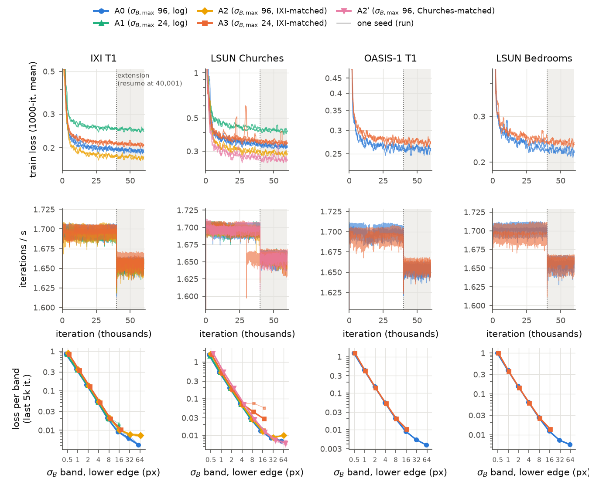
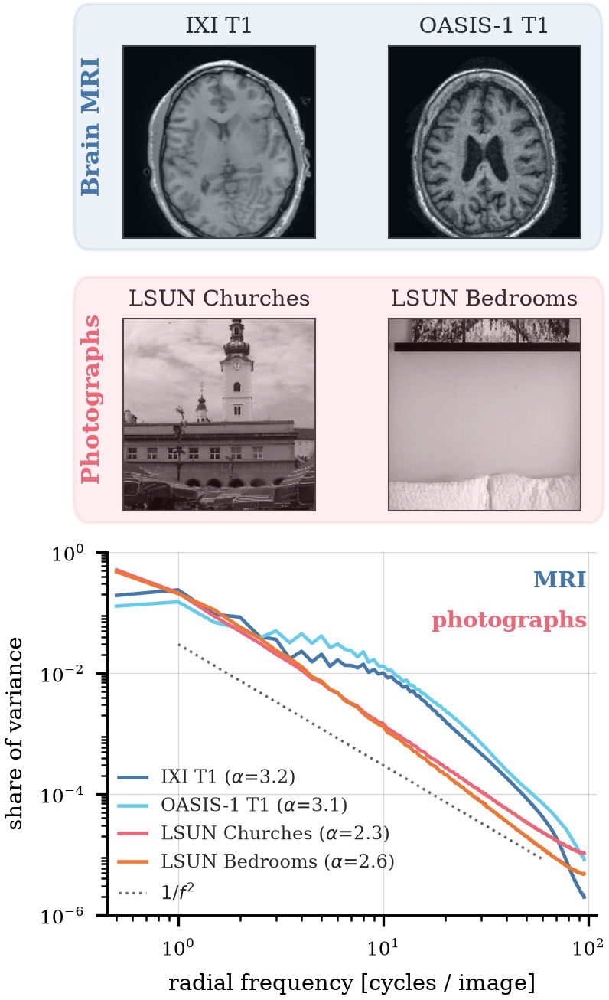
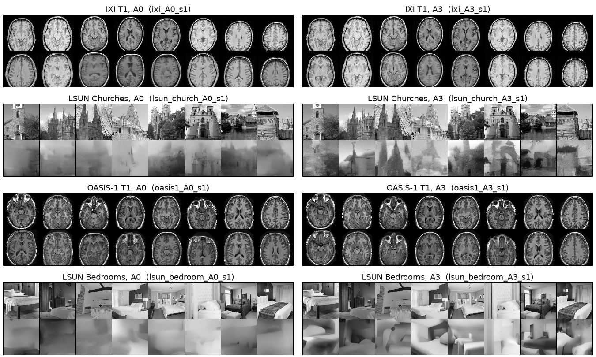
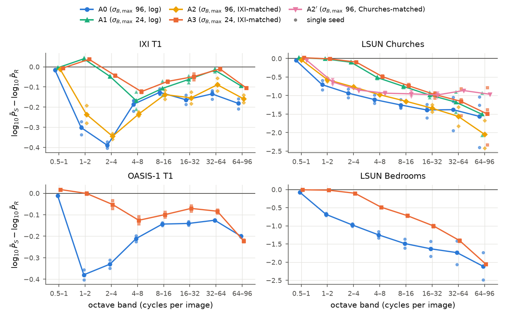
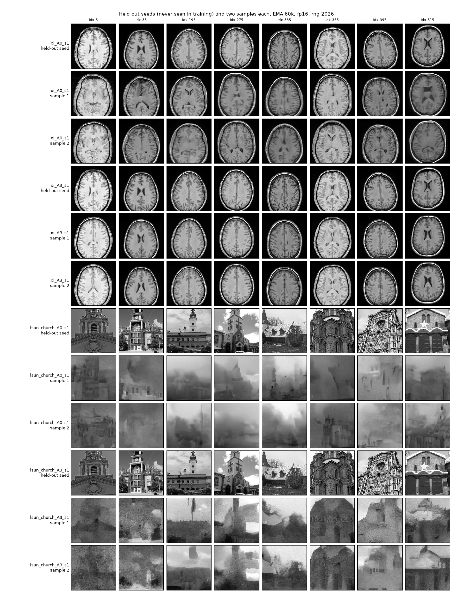
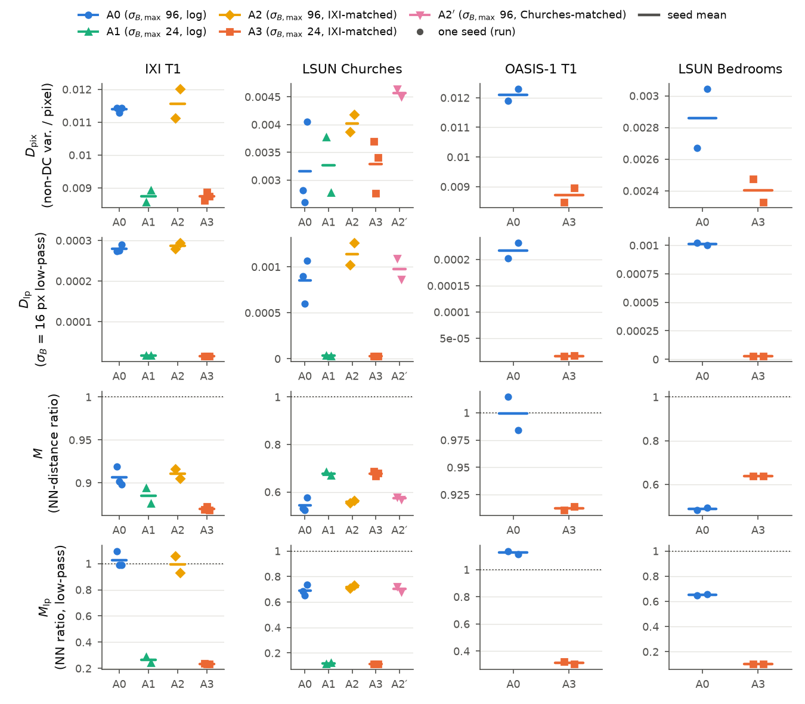
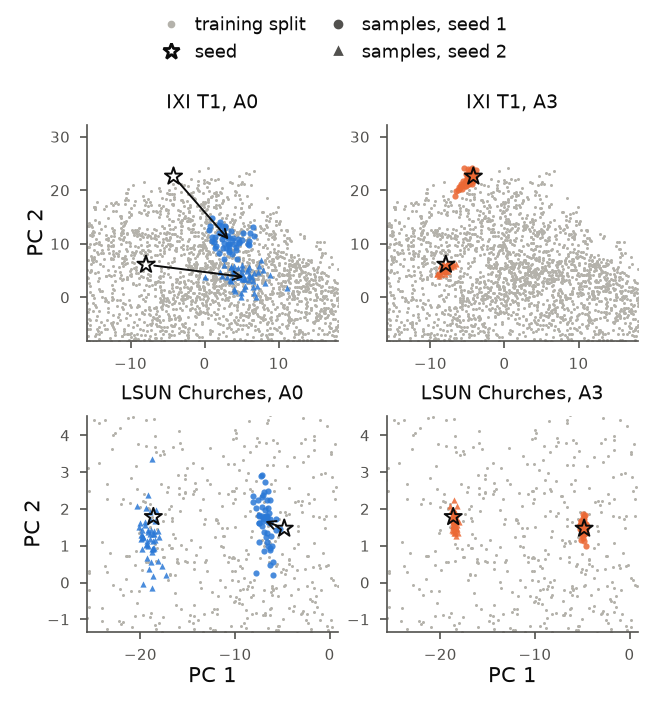
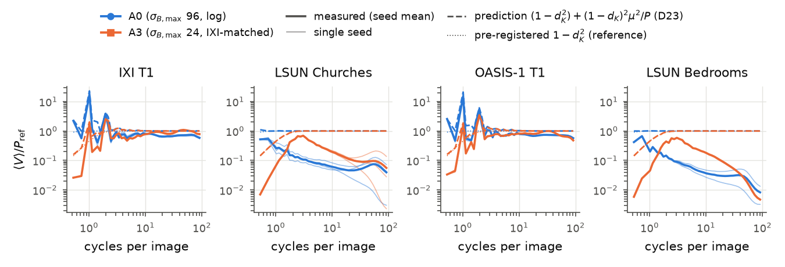
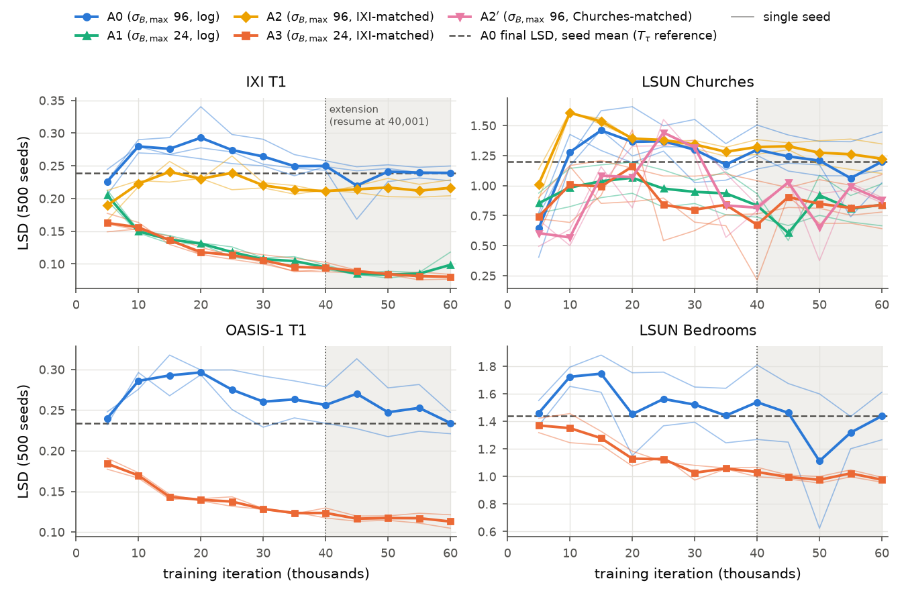
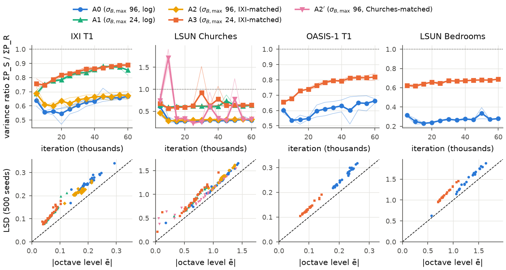

# Results and discussion: spectrum-matched blur schedules for IHDM on brain MRI

Written 2026-10-01 by the orchestrator (Claude Opus 5.5) for the team's report, from the final 30-run
collection (`collection.json` verdict COMPLETE, 2026-09-29). Every number below is copied from a
generated file and the source is named in each section:

- [`tables/`](tables/README.md): pre-registered, generated by `ihdm.cli.analyse`;
- [`figures/`](figures/README.md): generated by `ihdm.cli.figures`;
- [`exploratory/`](exploratory/exploratory.md): **not pre-registered**, generated by
  `ihdm.analysis.exploratory` and labelled *(exploratory)* wherever it is used.

The proposal is `projects/GenAI/project/6aab9fca47dc3902a0dbfcef/propuesta/templateArxiv.tex` in
the TFM repository.

**How to read the statistics.** A0 and A3 have 3 seeds per dataset; A1, A2, A2′ and the transfer
cells have 2. A 95% bootstrap CI over 3 seeds is exactly the [min, max] of the per-seed
differences. "CI excludes 0" therefore means only that **all seeds agree in sign** (a sign test,
p = 0.25 two-sided). The exact permutation p cannot fall below 0.1 (3 vs 3 seeds) or 1/3 (2 vs 2),
so nothing in this project can reach p < 0.05. We report signs, magnitudes and consistency; we do
not claim significance anywhere ([`tables/README.md`](tables/README.md), "Read this first").

**Revision of 2026-10-03** ([Orchestrator-GenAI], Claude Opus 5.5, written for Mario).

- **Added:**
  - §0, a reading guide;
  - §2a, every metric defined, calibrated and justified;
  - the figures and the two headline tables, inline;
  - the paper's own LSUN recipe in §3 (Rissanen et al. 2023, App. B, checked on 2026-10-03);
  - §11, the answers to the three questions of 2026-10-03.
- **Corrected:** §3 (images seen, U-Net size) and §6 (where the spacing gain sits).
- **Re-checked:** the parts written after W14 (the §1 bullets, the §3 diagnostic, the §8 δ sweep,
  §10 items 6–7) were not fact-checked when written. Their numbers were checked against
  `photo_diagnostic/README.md` and `delta_sweep/README.md` on 2026-10-03, and they match.
- **Fact-checked:** the 2026-10-03 additions were checked by an independent agent against the
  tables, the schedules, the figures and the paper. It found 6 wrong and 10 imprecise statements,
  all corrected. The largest was the size of the W/8 spacing change in §2, §6 and §11.2.
- **Added later on 2026-10-03:**
  - the statement that this project does not replicate the paper, with the compute shortfalls and
    the two trade-off checks (§0, §3, §10 item 8, §11.1);
  - §4.1, fidelity from held-out seeds (ticket T7.5, wave W15, post hoc), with its consequences in
    §1, §9, §10 item 9 and §11.

---

## 0. Reading guide

**The project in four sentences.**

1. IHDM (Rissanen, Heinonen and Solin, ICLR 2023, arXiv:2206.13397) starts each sample from a
   training image blurred with the heat equation to a terminal width $\sigma_{B,\max}$. This
   blurred image, plus a little noise, is the *prior state*.
2. It then undoes the blur in $K = 200$ learned steps (*levels*).
3. Two settings decide what the sampler is handed and where it spends its steps: the terminal blur
   $\sigma_{B,\max}$ and the spacing of the intermediate blur levels. The paper tuned both on
   photographs: W/2 and log spacing.
4. We asked whether brain MRI should use a smaller terminal blur (W/8) and a spacing fitted to its
   own spectrum, because registered brains share their coarse layout. We read the answer on IXI and
   OASIS-1 against two photograph sets.

**What this project is not: a replication of the paper.**

- Every dataset shares one recipe sized to a course-project budget, and the arms are compared
  within each dataset.
- Our samples are therefore far from the paper's quality on photographs.
- §3 lists each shortfall, and the two checks of the main trade-offs: data size and image
  resolution.

**Two corrections to how the setup is easily remembered.**

- **The terminal blur went *down*, from a broad blur to a narrow one.**
  - A0 blurs the seed image to σ_B,max = 96 px (W/2). Almost nothing of the seed survives above
    1 cycle per image.
  - A3 stops at 24 px (W/8). The prior keeps the seed's head outline, so the sampler starts from a
    state that already holds the coarse anatomy.
  - The rationale (H1): registered brains share that coarse layout, so handing it over should cost
    less memorisation than on photographs. In a photograph, the coarse layout is what makes each
    image different.
- **What the two spacings assume.**
  - The log spacing puts the same number of levels in every octave of σ_B. That is the right
    allocation when every octave carries the same between-image variance, which is the signature of
    a $1/f^2$ spectrum (Field 1987, doi:10.1364/JOSAA.4.002379).
  - The IXI-matched spacing places the levels so that every reverse step removes the same
    between-image variance on the IXI training split (H2).
  - Both endpoints (0.5 px and σ_B,max) stay fixed; only the interior levels move.

**The arms** (`configs/spectral/arms.py`):

| arm | σ_B,max | spacing | role |
|---|---|---|---|
| A0 | 96 px = W/2 | log | the paper's rule |
| A1 | 24 px = W/8 | log | the terminal blur alone |
| A2 | 96 px = W/2 | IXI-matched | the spacing alone |
| A3 | 24 px = W/8 | IXI-matched | the brain configuration (both changes) |
| A2′ | 96 px = W/2 | Churches-matched | control: photographs with their own matched spacing |

**Vocabulary used below.**

- **Sizes and frequencies.**
  - *W* = 192 px is the image side.
  - *Cycles per image* (c/img): 1 c/img is one cosine period across the image.
  - In a brain slice, the head outline lives at 0.5–2 c/img, the ventricles and the white-matter
    ring at 2–4 c/img, and finer anatomy above.
- **What a blur does.** A blur of width $\sigma_B$ multiplies the DCT mode at $c$ c/img by
  $d = \exp(-\sigma_B^2/\sigma_n^2)$, with $\sigma_n \approx 43.2/c$ px at W = 192 (§2a.6).
  - A level at $\sigma_B$ therefore works mostly on modes near $c \approx 43/\sigma_B$.
  - For example, σ_B = 96 px acts near 0.45 c/img, 24 px near 1.8 c/img and 1 px near 43 c/img.
- **Two kinds of samples.**
  - A *training-seeded* sample starts from a blurred *training* image (the paper's Alg. 2). These
    samples are used for fidelity and $M$.
  - A *held-out-seeded* sample starts from one of 40 `seed` subjects that are not in training.
    These samples are used for diversity and the inherited band.
- **Two meanings of "seed".** A *run seed* (1–3) is the random seed of a training run. A *seed
  image* is the image a prior state comes from.

**Where to look.**

- The metrics: §2a.
- The verdicts: §1 (table) and §11 (the three questions).
- The figures:
  - fig. 7 and the data figure in §2;
  - fig. 6 and the diagnostic grid in §3;
  - fig. 2 in §4, and the held-out-seed grid in §4.1;
  - figs. 3–5 and table 3 in §5;
  - fig. 1 and table 4 in §6;
  - the dispersion figure in §8.

---

## 1. Summary

| claim of the proposal | outcome | verdict |
|---|---|---|
| **H1a** W/8 costs memorisation and diversity "in every cell" | Seed copying rises on every dataset: the seed-NN fraction goes from 0.01–0.06 to 0.56–0.76, $M_{lp}$ falls 72–84% and $D_{lp}$ falls 92–97%. But $M$ *rises* on both photograph sets (+25%, +31%), and $D_{pix}$ does not move on Churches | partly supported: copying everywhere, the pixel-space falls on MRI only |
| **H1b** that cost is *smaller* on MRI than on photographs | The relative falls in the low-pass endpoints are about equal ($M_{lp}$ −77% vs −84%, $D_{lp}$ −95% vs −97%). In pixel space MRI loses more: $D_{pix}$ −23% vs +4%. On IXI at most 0.8 of the 7.9 points of within-seed variance lost can sit in the band the prior pins (§5) | **not supported**: the MRI cost is larger, and most of it is not inheritance |
| **H1c** MRI fidelity does not worsen at W/8 | IXI LSD −68%, KID −63%, FID −51%, precision +14%; OASIS-1 shows the same pattern. On held-out seeds (T7.5, §4.1), 96% of the precision gain holds but only 14% of the KID gain | supported (fidelity improves). The per-sample gain does not depend on memorised training images; most of the KID gain depends on seeding from many training images |
| **H1d** samples inherit the predicted *share* of the seed's variance ("about 5% on MRI against 30% on photographs") | Within-seed share at W/8: $I_w$ = 0.74 (IXI) and 0.93 (Churches), against the predicted $I$ = 0.08 and 0.29. On IXI the change ($\Delta I_w$ +0.079) happens to equal $\Delta I$ (+0.076); the bound of §5 shows this is a coincidence | **not supported**: the levels are far off because every model under-disperses |
| **H2a** IXI-matched spacing improves MRI fidelity | A2−A0 on IXI: LSD −11%, KID −11%, FID −9%, both seeds agree; about a sixth of the terminal blur's effect. On top of W/8 (A3 against A1) the two seeds disagree, so nothing is detectable | weak support on its own, in the predicted direction |
| **H2b** faster convergence ($T_\tau$) | The pre-registered $T_\tau$ is degenerate: the LSD curves are non-monotone, so the first crossing fires at 5k in most runs | not testable as designed |
| **H2c** the same spacing hurts photographs (crossover) | Churches A2−A0: LSD not detectable (the two seeds disagree, −0.35 and +0.22); KID −44% and FID −32%, both seeds agree | **not observed**; if anything the spacing helps |
| **A2′** control (photographs with their own matched spacing) | Better LSD than A2 (−0.35), worse KID (+0.086) and recall (−0.14). The samples are grainy texture without structure | LSD rewards noise; no support for "own spectrum is better" |
| **O3** transfer of the A3 signs to OASIS-1 and Bedrooms | IXI → OASIS-1: all 13 endpoints keep their sign (the degenerate $T_\tau$ rows left out). Churches → Bedrooms: 9 of 13. The exceptions are $D_{pix}$ (Churches +4%, not detectable; Bedrooms −16%) and the three inherited-band readings, which are near zero on both sets | supported, but see §7: A3's effect is mostly the terminal blur, which is fitted to nothing |

§11.2 gives the plain-language verdict on each intervention, with the size of each effect and an
explanation drawn from the data.

**The finding the proposal did not anticipate:** almost everything that moves in this experiment
is the variance of the samples.

- **Every model under-disperses.** Its samples are too alike at almost every scale: 227 of the 240
  final octave errors are negative, and the 13 positive ones are ≤ +0.045.
- **W/8 makes each sample a closer function of its seed** (our reading of §4–§5, not a tested
  claim). The prior pins the 0.5–2 cycles/image
  bands. The chain then fills in the 2–4 c/img band and finer structure more consistently with the
  seed: between-seed variance rises while within-seed variance falls (§4, §5). Fidelity measured
  on training-seeded samples and copying therefore rise together.
- **The photograph models fail outright at this budget.** Their samples land almost nowhere on the
  real-image manifold (§3), so every MRI-against-photograph interaction compares a working model
  with a failed one.
- **Two post-hoc diagnostics (M7), one seed each.**
  - Neither the paper's 128² whole-scene framing nor 10× more training images alone lifts the
    photograph failure under the pre-registered rule; the framing helps most (§3).
  - A larger sampling noise δ does not cure the under-dispersion: it only adds noise (§8).

---

## 2. What was run

| item | value | source |
|---|---|---|
| datasets | IXI T1 and LSUN Churches (development pair); OASIS-1 T1 and LSUN Bedrooms (transfer pair) | `00-overview.md` §1 |
| images | each set 3,200 train + 800 reference, 192², grayscale in [0, 1]. MRI: rigid MNI152 registration, N4, 10 axial slices per subject, split by subject (site-stratified on IXI). Photographs: 4,000 rows from a 6,312-row (Churches) / 15,157-row (Bedrooms) parquet shard, `convert('L')`, native-resolution 192² centre crop | `data_profile.md`; `meta.json` |
| arms | A0 (σ_B,max 96 = W/2, log spacing; the paper's rule), A1 (24 = W/8, log), A2 (96, IXI-matched), A3 (24, IXI-matched), A2′ (96, Churches-matched; Churches only) | `configs/spectral/arms.py` |
| seeds | A0 and A3 ×3 on IXI and Churches; A1, A2, A2′ ×2; A0 and A3 ×2 on OASIS-1 and Bedrooms; 30 runs | `EXPERIMENT_CELLS` |
| model | released IHDM code, CIFAR-scale U-Net (61 M parameters), K = 200, σ = 0.01, δ = 1.25σ, prior noise on | `00-overview.md` D4 |
| recipe | batch 16, Adam lr 1e-4 (D19), warm-up 1,000, clip 1.0, fp16 AMP, EMA 0.999, **60,000 iterations** (40k extended by resume, D22) | `submissions.md` §8 |
| evaluation | EMA weights. LSD curve: 12 checkpoints (5k…60k) × 500 frozen training seeds, with common random numbers across checkpoints and arms (D17). Final set: 2,000 training-seeded samples (LSD, KID, FID, precision/recall/density/coverage, $M$). Held-out set: 40 seeds × 50 samples (diversity, inherited band). Reference: the 800-image `ref` split. Sampling in fp16 (D20) | `05-metrics.md`; `evaluation_plan.md` |
| compute | A100 40 GB: 1.70 it/s, ≈ 10 h of training per run (≈ 300 A100-h for 30 runs); 5.4–6.8 h of sampling per run (≈ 200 A100-h). Not counted: the failed first array and run 11's retries | `submissions.md`; `summary.json` `sampling.log` |

**Deviations from the proposal**, all recorded as decisions in `00-overview.md`:

- **D19:** lr 1e-4 instead of 2e-4, after the first array diverged.
- **D22:** 60k iterations instead of 20k. The pre-registered plateau gate triggered the extension (IXI LSD 35k → 40k: −0.0095, 95% CI [−0.0114, −0.0076]); the 55k/60k gate showed no further gain.
- **D21:** run 11 (`lsun_church_A3_s3`) needed 3 attempts and carries 6 skipped fp16 steps.
- **D20:** sampling ran in fp16. The LSD moves by 5e-5, 0.1% of the IXI noise floor.
- **D23:** the pre-registered inherited-share estimator is biased when the mean image is not zero. It is corrected at reading time.
- **Budget:** the proposal estimated 150 A100-h of training at 20k iterations, with sampling extra. Training took ≈ 300 A100-h (2×, because of the 60k length), and the whole campaign ≈ 500.

**Training sanity** ([`figures/fig7`](figures/fig7_training_sanity.png), table 8). `check_array`
reports 30/30 runs healthy, with no abort and no skipped step during the extension. Loss curves are
flat after ≈ 25k. Loss levels differ between arms because each arm regresses its own schedule's
targets, so they are not compared. The Churches LSD oscillates between checkpoints: A0 s1 moves
between 1.35 and 1.50 over 35k–60k, and A3 s1 goes from 0.22 at 40k to 0.91 at 45k. That
oscillation is larger than several arm effects on Churches (§6).



*Figure 7.* For every run:

- top: the training loss;
- middle: the throughput;
- bottom: the per-band training loss over the last 5k iterations.

Each arm regresses its own schedule's targets, so loss levels are not compared across arms; the
panel checks stability only. A flat loss does not mean the samples have converged. About 98% of
each level's regression target is irreducible training noise (`learning/03` §6), so sample quality
must be read from the samples (fig. 1).

**The data.**



*Data figure* (the proposal's Fig. 1, regenerated on the final N4 data; `data_profile.md` §7).

- **Top:** one 192² example per dataset.
- **Bottom:** the share of between-image variance per radial frequency, on the 3,200 training
  images of each dataset.
- **How the MRI curves differ.** They sit *below* the photographs at 0.5–1 c/img, because
  registered brains differ little there. They sit *above* them from about 3 to about 60 c/img, and
  then fall faster. The slope α is 3.1–3.2 for MRI against 2.3–2.6 for photographs, fitted on
  10–67 c/img. Over 1–48 c/img the MRI slope is only 2.1 (`data_profile.md` §1).

**The schedules.** Where each schedule puts its 200 levels (`data_profile.md` §5). The second row
gives the frequency each σ_B octave mainly acts on ($c \approx 43/\sigma_B$, §0):

| σ_B (px) | 0.5–1 | 1–2 | 2–4 | 4–8 | 8–16 | 16–32 | 32–64 | 64–96 |
|---|---|---|---|---|---|---|---|---|
| acts near (c/img) | 43–86 | 22–43 | 11–22 | 5.4–11 | 2.7–5.4 | 1.4–2.7 | 0.7–1.4 | 0.45–0.7 |
| A0 `log_W2` | 27 | 26 | 26 | 26 | 27 | 26 | 26 | 16 |
| A2 `ixi_W2` | 19 | 30 | 38 | 35 | 26 | 23 | 20 | 9 |
| A2′ `lsun_church_W2` | 19 | 21 | 23 | 26 | 28 | 31 | 33 | 19 |
| A1 `log_W8` | 36 | 36 | 35 | 36 | 36 | 21 | 0 | 0 |
| A3 `ixi_W8` | 24 | 37 | 46 | 43 | 32 | 18 | 0 | 0 |

**How far the matched spacing moves the levels.** Computed on 2026-10-03 from `schedules/*.npy`
and checked by an independent agent. Four measures:

- **net reallocation:** half the summed absolute difference between the two rows of the table
  above, i.e. how many levels the octave histogram shifts;
- **octave changes:** pairing level $k$ of one schedule with level $k$ of the other, how many
  levels land in a different σ_B octave;
- **per-level σ_B ratio:** matched over log, level by level;
- **mean |log ratio|:** the mean absolute log of that ratio.

| pair | net reallocation | octave changes (index-matched) | per-level σ_B ratio, min / median / max | levels off by > 10% / > 20% | mean \|log ratio\| |
|---|---:|---:|---|---:|---:|
| A2 against A0 (at W/2) | 25 of 200 (12.5%) | 73 | 0.64 / 0.80 / 1.21 | 164 / 115 | 0.25 |
| A3 against A1 (at W/8) | 19 of 200 (9.5%) | 33 | 0.87 / 1.03 / 1.29 | 123 / 55 | 0.13 |

**At W/8 the matched spacing changes the schedule about half as much as at W/2, on every
measure.** It is still a real change: 55 of 200 levels move by more than 20%. §6 and §11.2 use
this.

---

## 2a. The metrics, one by one

**What every metric is compared against.**

- Every metric is computed against the `ref` split: 800 held-out images, which for MRI are 80
  held-out subjects × 10 slices.
- None is computed against training data, with one exception by design: the nearest-neighbour
  distances of $M$, which measure the distance *to* the training set.
- The formal contract is `docs/SPECIFICATIONS/05-metrics.md`; this section explains it.

**Quick reference** (seed means; ↓ lower is better, ↑ higher is better, "→ x" the ideal value is
x):

| metric | ideal | the question it answers | used for | IXI A0 → A3 | Churches A0 → A3 |
|---|---|---|---|---|---|
| LSD | ↓; floor 0.02–0.05 | is the between-image variance right at every scale? | H2, fidelity | 0.242 → 0.078 | 1.201 → 0.830 |
| octave error $e_b$ | → 0 | the same, per band; + too much, − too little | where an arm acts | fig. 2 | fig. 2 |
| variance ratio | → 1 | total variance of the samples over the reference's | dispersion | 0.66 → 0.89 | 0.29 → 0.65 |
| $T_\tau$ | ↓ | when an arm first reaches A0's final LSD | H2b | degenerate | degenerate |
| KID | ↓; → 0 | distance between the sample and reference distributions (Inception features, unbiased) | fidelity, headline | 0.046 → 0.017 | 0.312 → 0.162 |
| FID | ↓ | the same, Gaussian approximation, biased up at 800 references | fidelity, secondary | 56.5 → 27.8 | 257.7 → 168.6 |
| precision | ↑, ≤ 1 | do the samples look like some real image? | fidelity; failure check | 0.634 → 0.722 | 0.003 → 0.089 |
| recall | ↑, ≤ 1 | is every kind of real image produced? | diversity across images | 0.307 → 0.432 | 0.003 → 0.094 |
| density | ↑, about 1 when matched | how densely the samples sit among real images | fidelity (exploratory) | 0.37 → 0.48 | 0.0007 → 0.033 |
| coverage | ↑, ≤ 1 | share of real images that have a sample nearby | diversity across images | 0.467 → 0.775 | 0.006 → 0.110 |
| $M$ | → 1; < 1 copying, > 1 off-manifold | nearest-training-image distance relative to a new real image | H1 (memorisation) | 0.906 → 0.870 | 0.543 → 0.677 |
| $M_{lp}$ | → 1 | the same after a σ_B = 16 px low-pass (coarse layout only) | H1 | 1.026 → 0.235 | 0.691 → 0.114 |
| seed-NN fraction | ↓, about 0 for a new image | share of samples whose nearest training image is their own seed image | H1 (copying) | 0.063 → 0.721 | 0.009 → 0.623 |
| $D_{pix}$ | no absolute ideal; ↑ = more freedom | variance of 50 samples from one prior state | H1 (within-seed diversity) | 0.0114 → 0.0087 | 0.0032 → 0.0033 |
| $D_{lp}$ | the same | the same after the σ_B = 16 px low-pass | H1 | 2.8e-4 → 1.5e-5 | 8.5e-4 → 2.9e-5 |
| $I$ (predicted) | — | share of the population variance the prior hands over (a model) | H1d | 0.003 → 0.080 | 0.018 → 0.289 |
| $I_w$ | → $I$ | the share actually fixed by the prior state (measured) | H1d | 0.658 → 0.738 | 0.936 → 0.934 |
| ρ | → 1 | the removed variance that the chain actually regenerates | dispersion (exploratory) | 0.34 → 0.28 | 0.065 → 0.093 |

### 2a.1 Per-mode variance: the quantity everything spectral is built on

Take a stack of $N$ images $X_1, \dots, X_N$ (192 × 192, values in [0, 1]).

1. Subtract the mean image $\bar X$.
2. Take the orthonormal 2-D DCT of each centred image.
3. Average the squared coefficients over the stack:

$$P(i,j) = \frac{1}{N}\sum_{k=1}^{N} \widehat{(X_k-\bar X)}(i,j)^2 .$$

$P(i,j)$ is the **between-image variance** of mode $(i,j)$: how much the images differ from one
another in that cosine pattern.

- It is *not* the power spectrum of one image. The mean image (the average brain, or the average
  church) is removed first and does not count.
- The DC mode (overall brightness) is excluded everywhere.
- Mode $(i,j)$ has radial index $n = \sqrt{i^2+j^2}$ and carries $n/2$ cycles per image.
- Averaging $P$ over the modes in a frequency bin gives the radial profile $\bar P(b)$. The profile
  uses 48 log-spaced bins from 0.5 to 96 c/img (43 hold at least one mode on the 192² grid) or the
  8 octaves 0.5–1, …, 64–96.

**Why this quantity.** It is what the heat blur removes and what the reverse chain must put back.
The data figure plots it, the schedules were fitted on it, and the prior's inherited share is
computed from it. Every spectral metric below compares $\bar P$ of the samples ($S$) with
$\bar P$ of the reference ($R$).

### 2a.2 LSD, the octave errors, the variance ratio, level and shape

**Log-spectral distance:**

$$\mathrm{LSD}(S,R)=\sqrt{\frac{1}{B}\sum_{b=1}^{B}\Big(\log_{10}\bar P_S(b)-\log_{10}\bar P_R(b)\Big)^2},\qquad B = 43 .$$

- **What it means.** LSD is the RMS, over frequency bins, of the log-ratio between how much the
  samples vary and how much real images vary at each scale.
  - LSD = 0.1 means the profile is off by a factor $10^{0.1} = 1.26$ in RMS.
  - IXI A0's 0.242 is a factor 1.75. IXI A3's 0.078 is a factor 1.20.
  - Churches A0's 1.20 is a factor 16.
- **Direction and floor.** Lower is better. A perfect model would sit at the floor, which is the
  LSD between two halves of the real reference (`metrics_bracket.md` §1).
  - 400 against 400 real images, split by subject: 0.047 (IXI), 0.049 (OASIS-1); 0.023
    (Churches), 0.037 (Bedrooms).
  - 3,200 training against 800 reference images: 0.017 (IXI).
  - A model after only 750 iterations scores 0.78.
- **Why we chose it.**
  1. It needs no pretrained network. Inception was trained on colour ImageNet photographs, and its
     features on grayscale brain slices are only a proxy.
  2. It is the quantity the schedules act on, so its per-octave profile can show *where* in
     frequency an arm helps.
  3. It is cheap enough to compute at 12 checkpoints, which gives the convergence curves H2b
     needed.
  4. Spectral discrepancies of this kind are an established diagnostic of generators: Durall et al.,
     CVPR 2020, arXiv:2003.01826; Schwarz et al., NeurIPS 2021, arXiv:2111.02447.
- **Its weakness, which this project exposed.** LSD sees only *how much* the images vary at each
  scale. It is blind to *what* varies: phase, position, structure. A set of noise images with the
  right spectrum scores LSD ≈ 0. Three cases in this project show it:
  - A2′'s grainy texture wins on LSD (§6);
  - n32k improves LSD by 34% with no gain in precision (§3);
  - δ = 2σ noise lowers Churches A0's LSD (§8).

**Per-octave error** $e_b = \log_{10}\bar P_S(b) - \log_{10}\bar P_R(b)$ on the 8 octaves.
- The sign is kept: negative means the samples are *too alike* in that band, positive means they
  vary too much.
- Fig. 2 plots it; 227 of the 240 final values are negative.

**Variance ratio** $\sum P_S / \sum P_R$ over all non-DC modes.
- 1 means the samples carry the right total variance; below 1 they are under-dispersed.
- Real-against-real gives 0.93–1.04.

**Level and shape** (*exploratory*, X1). Split the 8 octave errors into their mean, the *level*
$\bar e$, and their spread, the *shape* $\mathrm{sd}(e)$. Because a mean of squares is the square
of the mean plus the variance,

$$\underbrace{\tfrac18\textstyle\sum_b e_b^2}_{\text{octave RMS}^2} \;=\; \bar e^{\,2} + \mathrm{sd}(e)^2 .$$

- The level is a broadband deficit or excess: every band too low or too high together.
- The shape is a misallocation across scales: some bands too low, others too high.
- In this project the level carries a mean 65% (median 71%) of the squared error. In other words,
  LSD here mostly measures dispersion (§8).

**Late-window LSD** (*exploratory*): the mean of the 45k, 50k, 55k and 60k checkpoints. It damps
the checkpoint-to-checkpoint oscillation of the photograph runs.

### 2a.3 $T_\tau$, the settling step and the plateau gate

**$T_\tau$** is the first checkpoint at which an arm's LSD falls to or below the final LSD of the
A0 run with the same seed.
- **Why we chose it.** H2 claimed faster convergence, and the loss cannot show convergence (fig. 7).
- **Why it failed.** It assumes curves that fall monotonically. Ours do not: the A0 curves rise
  until 15–20k and fall afterwards, and the W/8 arms start below A0's final value. So it fires at
  the first checkpoint (5k) in 24 of 30 runs. It is reported as pre-registered and read as
  uninformative.

**The settling step** (*exploratory*) is the first checkpoint after which the curve *stays* below
the threshold.

**The plateau gate** decided the training length. It is a paired bootstrap over the 500 frozen
seeds of LSD(35k) − LSD(40k); training was extended when the interval lay above zero, which
happened on IXI (D22).

### 2a.4 The Inception family: FID, KID, precision, recall, density, coverage

**Pipeline.** Samples and references are grayscale images replicated to 3 channels, resized to 299²
by clean-fid (Parmar et al., CVPR 2022, arXiv:2104.11222) and embedded by Inception-v3. Each
image becomes a 2,048-dimensional feature vector, and every metric below compares the two clouds
of vectors.

**FID** (Heusel et al., NeurIPS 2017, arXiv:1706.08500) fits a Gaussian to each cloud:

$$\mathrm{FID}=\lVert\mu_S-\mu_R\rVert^2+\operatorname{Tr}\!\big(\Sigma_S+\Sigma_R-2(\Sigma_S\Sigma_R)^{1/2}\big).$$

- Lower is better.
- Its estimator is biased upward by an amount ∝ 1/N (Chong and Forsyth, CVPR 2020,
  arXiv:1911.07023), and our reference has only 800 images. So our FIDs are inflated, and they are
  comparable only between arms of one dataset, where the shared reference cancels most of the bias
  (see the last bullet under KID).
- The paper's 45.06 used 50,000 samples against the whole LSUN training set (App. B.3), so it
  cannot be compared with ours at all.

**KID** (Bińkowski et al., ICLR 2018, arXiv:1801.01401) is the squared maximum mean discrepancy
between the two clouds, with the cubic kernel $k(x,y) = (x^\top y/2048 + 1)^3$:

$$\mathrm{KID}=\widehat{\mathrm{MMD}}^2_u = \tfrac{1}{m(m-1)}\textstyle\sum_{i\ne j}k(s_i,s_j)+\tfrac{1}{n(n-1)}\sum_{i\ne j}k(r_i,r_j)-\tfrac{2}{mn}\sum_{i,j}k(s_i,r_j).$$

- It is unbiased: about 0 for identical distributions, and it can be slightly negative. That is why
  it is the headline (`05-metrics.md` §7).
- On FID's bias: sharing the reference across arms cancels most of it, but not all. The 1/N
  coefficient depends on the generator (Chong and Forsyth), so small FID differences between arms
  carry some residual bias. KID has no such bias.
- **Calibration on real IXI images** (`metrics_bracket.md` §6.7). Blurring real brains by
  σ_B = 1, 2, 4 and 8 px gives KID 0.030, 0.097, 0.193 and 0.366. Two halves of the same images
  give 0.003. As a feel for the numbers:
  - IXI A3 (0.017) is closer to the real brains than a 1 px blur of them;
  - IXI A0 (0.046) sits between a 1 px and a 2 px blur;
  - Churches A0 (0.31) is as far off as a 4–8 px blur. This last one is an analogy only, because
    the ladder was measured on brains.

**Precision and recall** (Kynkäänniemi et al., NeurIPS 2019, arXiv:1904.06991) approximate each
cloud's support by the union of balls around its points; each ball's radius is the distance to the
point's 5th nearest neighbour. With $X$ the real images and $Y$ the samples:

$$\text{precision}=\tfrac1{|Y|}\textstyle\sum_{y}\mathbf 1\big[\exists x:\ y\in B(x,\mathrm{NND}_5(x))\big],\qquad \text{recall}=\tfrac1{|X|}\sum_{x}\mathbf 1\big[\exists y:\ x\in B(y,\mathrm{NND}_5(y))\big].$$

- *Precision*: does each sample fall where real images live? This is fidelity per sample.
- *Recall*: does every real image have a sample near it? This is diversity across images.
- Both lie in [0, 1], and higher is better.

**Density and coverage** (Naeem et al., ICML 2020, arXiv:2002.09797) are versions that are robust
to outliers:

$$\text{density}=\tfrac{1}{5|Y|}\textstyle\sum_{y}\sum_{x}\mathbf 1\big[y\in B(x,\mathrm{NND}_5(x))\big],\qquad \text{coverage}=\tfrac1{|X|}\sum_{x}\mathbf 1\big[\exists y:\ y\in B(x,\mathrm{NND}_5(x))\big].$$

- Density is about 1 when the two distributions match, and it can exceed 1.
- Coverage lies in [0, 1].
- Higher is better for both.

**Why we chose this family.**
- Inception metrics are what every image-generation paper reports. KID is the headline because it
  is unbiased at our small N.
- Recall and coverage test H1's "diversity across images".
- Precision became the failure diagnostic for the photograph models: 0.3% of Churches A0 samples
  look like a real church to Inception.
- The FID licence check showed that the features respond monotonically to blur on grayscale brains
  (`metrics_bracket.md` §6.7), which is the precondition for reading them on MRI at all.

**Caveats.**
- Values are never compared across datasets.
- The photo-diagnostic and δ-sweep values come from 500-sample sets, so they are not comparable
  with tables 1a and 2.

### 2a.5 Memorisation: $M$, $M_{lp}$ and the seed-NN fraction

Let $d(y)=\min_{x\in\text{train}}\lVert y-x\rVert_2$ be the distance from an image to its nearest
training image, in pixel space, with the DC removed and over the *full* training split.

$$M=\frac{\operatorname{median}_{y\,\in\,\text{training-seeded samples}}\ d(y)}{\operatorname{median}_{r\,\in\,\text{held-out real images}}\ d(r)} .$$

- **Reading.**
  - $M = 1$: the samples are as far from the training set as a new real image. Calibration: real
    `ref` images give 1.001.
  - $M < 1$: the samples sit closer to training images than new real images do, i.e. copying.
  - $M > 1$: the samples are off the data manifold. The model after only 750 iterations gives
    1.75.
- **$M$ is not one-sided.** Blurry samples are close to everything in $L_2$. So Churches A0's
  $M$ = 0.54 is blur, not copying, and $M$ *rises* with A3 as the samples gain structure. $M$ can
  be read as copying only for a run whose LSD and KID say it fits.
- **$M_{lp}$** is the same ratio after both sides are low-passed with a σ_B = 16 px heat kernel.
  - The low-pass keeps modes below about 1.6 c/img at half power: $d^2 = 0.5$ when
    $2(16c/43.2)^2 = \ln 2$.
  - So $M_{lp}$ measures copying of the coarse layout, which is exactly the band a W/8 prior hands
    over. Its collapse at W/8 is close to tautological (§5).
- **Seed-NN fraction**: the share of training-seeded samples whose nearest training image is their
  own seed image.
  - On MRI, any of the seed subject's 10 slices counts; on photographs, only the seed image. The
    two groups are therefore not directly comparable.
  - A new image would score about 0.
- **Why we chose these.**
  - H1 is a claim about memorisation.
  - The proposal's ethics paragraph flagged the kernel-density prior as a privacy risk; the paper
    itself only shows nearest neighbours visually (App. D.5).
  - $M$ is in the spirit of the data-copying test of Meehan, Chaudhuri and Dasgupta (AISTATS 2020,
    arXiv:2004.05675), which compares distances from samples to the training set with distances
    from held-out data.
  - It is computed on *training*-seeded samples on purpose: a held-out-seeded sample cannot copy
    its seed from the training set.

### 2a.6 Within-seed diversity and the inherited band: $D_{pix}$, $D_{lp}$, $I$, $I_w$, ρ

**Within-seed diversity.**
- **The procedure.** For each of the 40 held-out seed images, the sampler starts 50 times from the
  *same* prior state, with independent sampling noise.
- **$D_{pix}$** is the variance across those 50 samples, per pixel and with the DC removed,
  averaged over the 40 seeds. $D_{lp}$ is the same after the σ_B = 16 px low-pass.
- **Reading.** Higher means the sampler has more freedom once the prior state is fixed. There is no
  absolute ideal value; the model below supplies the expected one.
- **Why we chose it.** H1 predicted that it falls at W/8, and falls less on MRI.

**The model that turns these into shares (linear-Gaussian, `learning/03` §13; `05-metrics.md`
§5).**

- **The blur.** In the DCT basis the heat blur multiplies mode $i$ by
  $d_i=e^{-\lambda_i t_K}$, with $t_K=\sigma_{B,\max}^2/2$.
- **The frequency mapping.** For the DCT Laplacian at W = 192, $\lambda_i = (\pi n_i/W)^2$. Writing
  $\sigma_n=\sqrt{2/\lambda}$ gives $d=\exp(-\sigma_B^2/\sigma_n^2)$ with
  $\sigma_n = \sqrt2\,W/(2\pi c) \approx 43.2/c$ px at $c$ c/img. This is the mapping of §0.
- **What an ideal sampler does.** It keeps the surviving part $d_i x_{\text{seed},i}$, which is
  identical in all 50 samples, and regenerates the removed part, whose variance is
  $(1-d_i^2)P_i$.
- **Two consequences:**
  - the samples' total variance is $d_i^2P_i + (1-d_i^2)P_i = P_i$, the right amount;
  - the within-seed variance is $(1-d_i^2)P_i$.
- **The predicted inherited share**, i.e. the share of the population variance pinned by the prior:

$$I=\frac{\sum_i d_i^2 P_i}{\sum_i P_i}.$$

  - IXI: 0.3% at W/2 and 8.0% at W/8.
  - Churches: 1.8% and 28.9% (`inherited_band_constants.json`).
- **The measured within-seed share** (D23). This is the share of the population variance that does
  *not* vary within a seed:

$$I_w = 1-\frac{\tfrac{50}{49}\,D_{pix}\,(W^2-1)}{\sum_i P_{\text{ref},i}} .$$

  - Here $D_{pix}(W^2-1)$ is the per-pixel variance summed over the $W^2-1$ non-DC degrees of
    freedom. By Parseval this equals the summed within-seed variance of the modes. The factor 50/49
    makes the variance estimate unbiased.
  - Under the model its expectation is $I$ whatever the mean image.
  - The pre-registered estimator measured the residual about $d_K\hat x_s$. That residual also
    counts the term $(1-d_K)\mu$, which a model must add to every sample to restore the mean image,
    so the estimate is biased by $-T$ (D23, `inherited_band_audit.md`). Do not read the
    pre-registered share; read $I_w$.
- **The regeneration ratio** (*exploratory*):

$$\rho=\frac{1-I_w}{1-I}=\frac{\text{within-seed variance actually produced}}{\text{variance the blur removed}} .$$

  - ρ = 1 is an ideal sampler; ρ < 1 regenerates too little (under-dispersion); ρ > 1 adds too
    much (noise).
  - Measured: IXI 0.34 (A0) and 0.28 (A3); Churches 0.065 and 0.093; 1.2–6.4 at δ = 2σ.
- **Why we chose these.** H1d said that samples inherit "about 5% of the variance on MRI against 30%
  on photographs", i.e. that $I_w \approx I$. These quantities test the mechanism behind H1, not
  only its outcome. The answer (§5): $I_w \gg I$ everywhere, because the models under-disperse.

### 2a.7 The statistics

- **Paired contrast.** $\Delta = m(\text{arm}) - m(\text{A0})$, paired by run seed (seed 1 with
  seed 1, and so on).
- **The bootstrap CI over 3 seeds is exactly [min, max] of the three paired Δ.**
  - A bootstrap resample's mean equals the smallest Δ only when all three draws hit it, which has
    probability $(1/3)^3 = 3.7\%$. That is above 2.5%, so the 2.5th percentile *is* the minimum,
    and likewise for the maximum.
  - "CI excludes 0" therefore means only that all seeds agree in sign. Under a symmetric null that
    happens with probability $2\cdot(1/2)^3 = 0.25$.
- **The exact permutation p has a floor.**
  - With 3 against 3 seeds there are $\binom63 = 20$ label assignments. The observed one and its
    mirror always tie, so the smallest two-sided p is 2/20 = 0.1.
  - With 2 against 2 seeds there are $\binom42 = 6$ assignments, so the floor is 1/3.
  - No result in this project can be "significant at 0.05", by construction.
- **Interaction**: $\Delta_{\text{IXI}}-\Delta_{\text{Churches}}$, the pre-registered estimand of
  H1 and H2 (table 3).
- **Decomposition** (table 4): share A1 = $\Delta_{A1}/\Delta_{A3}$ and share A2 =
  $\Delta_{A2}/\Delta_{A3}$ on seeds 1–2. A sum near 1 means the two knobs add up.
- **Δ/A0** is the relative change (*exploratory*), used to compare sizes across datasets.
- **Transfer** is read as sign agreement only.
- **Why the statistics are this weak.** A run costs about 10 A100-h of training plus about 7 of
  sampling. Seeds were the expensive unit, and the design spent them on arms and datasets.

---

## 3. Is A0 on LSUN a replication of the paper?

**No. This project never set out to replicate Rissanen et al. (2023).**

- **The question was comparative.** Do the terminal blur and the level spacing need to depend on
  the spectrum of the data? To answer it, we kept one code base, one recipe and one image count
  for all four datasets, and compared arms *within* each dataset.
- **The comparisons rest on that internal equality, not on matching the paper's sample quality.**
  A0 keeps the paper's *schedule rules* (terminal blur W/2, log-spaced levels, the paper's σ and
  δ). Everything else that sets sample quality was set by what a course project could afford.

**Where we fell short of the paper, and why.** A paper-scale recipe was out of reach.

- The paper's one LSUN model took about 110 A100-h: 1M iterations at 11 h per 100k (App. B.2).
- Our design needs 30 runs: 2 terminal blurs × 2 spacings, plus the A2′ control, 2–3 seeds each,
  on four datasets.
- At the paper's scale, the 30 runs would have cost about 3,300 A100-h of training. That is 11×
  what we actually spent on training (about 300 A100-h), 22× the proposal's budget (150 A100-h),
  and more again at 192².

So we fell short on every axis that costs compute (the table below gives each one):

1. **Training length:** 60k iterations against 1M; 3% of the images seen.
2. **Model size:** the CIFAR-scale U-Net, 61 M parameters against 160 M.
3. **Training data:** 3,200 images per dataset against about 126k for LSUN Churches. The equal
   image count was chosen deliberately, so that MRI and photographs differ only in their content.
4. **Number of levels:** K = 200 against 400.
5. **Optimisation:** lr 1e-4 with batch 16, against 2e-5 with batch 32.
6. **Colour:** grayscale against RGB.

**What we checked instead.** Before reading any MRI-against-photograph comparison, we tested the
two trade-offs a compute-limited design makes first. This was post hoc (M7), with one seed per
factor, and is described after the table:

- **dataset size:** n32k, 10× more training images;
- **image resolution and framing:** r128, the paper's 128² whole-scene framing;
- the sampler's noise as a third, free check (the δ sweep, §8).

The comparison with the released LSUN Churches config
(`configs/lsun_church/default_lsun_configs.py`) and the paper's App. B:

| | the paper and its released config | this experiment, A0 |
|---|---|---|
| training data | the full LSUN Churches (church_outdoor) train set, ≈ 126k images, RGB | 3,200 images from one parquet shard, grayscale |
| framing | whole scene resized to 128² | native-resolution 192² centre crop (a zoomed-in part of the scene) |
| U-Net | `channel_mult (1,2,3,4,5)`, attention at 32², 16², 8²; 2 res-blocks per level in the paper (App. B.1; the released config says 4): **160 M parameters** (262 M with 4) | CIFAR-scale `(1,2,2,2)`, attention at 2 levels, 4 res-blocks: **61 M parameters** (both 128 base channels, dropout 0.1) |
| K | 400 (the paper: it "increased sample quality slightly", App. B.4) | 200 |
| prior and top level | the released code puts no noise on the prior draw and does not train level K | δ-noise on the prior and level K trained, as the paper's text states (D3) |
| optimisation | batch 32, lr 2e-5, warm-up 5,000; trained for **1M iterations** (App. B.2; the config's `n_iters` is 1.3M) | batch 16, lr 1e-4, warm-up 1,000, 60k |
| images seen | 32M (1M × 32), ≈ 250 epochs over 126k images | 0.96M (60k × 16), i.e. **3% of the paper's**, or 300 epochs over 3,200 images |
| FID protocol | 50,000 samples against the training set (App. B.3) | 2,000 samples against the 800-image `ref` split |

The parameter counts were measured on 2026-10-03 by instantiating `model_code.unet.UNetModel` with
each architecture. The paper's facts come from its App. B (arXiv:2206.13397v3).

The project's notes record an IHDM FID of 45.06 for LSUN Churches 128²
(`projects/GenAI/learning/02-spectral-bias-and-experiments.md`). Our FID (258 on Churches A0) is
not comparable to it: 800 references bias FID upward, and the data and resolution differ. The
Inception precision points the same way: 0.3% of Churches A0 samples fall inside the real-image
manifold (k = 5), against 63% on IXI A0. `05-metrics.md` §7 rules out comparing Inception metrics
across datasets as an endpoint, and precision depends on the reference set. With the same
N_ref = 800 and k = 5 on both sides, though, a 200-fold gap is far beyond any reference effect, and
it is used here only as a diagnostic of failure. The grids
([`figures/fig6`](figures/fig6_grids.png)) show blurry, structureless blobs on both photograph
sets at A0.



*Figure 6.* The trainer's monitoring grids at 60k, run seed 1. In each block, the top row holds 8
training seed images and the bottom row the sample each one produces.

- **The brains** are plausible at both blurs.
  - At A3 (right) each sample is visibly its own seed slice: the same slice level, head shape and
    ventricles.
  - At A0 (left) the samples are brains that often sit at a different slice level from their seed.
    They keep mostly the seed's overall brightness, which is all a 96 px blur leaves.
- **The photographs** at A0 are grey fog. At A3 they gain the seed's coarse layout (towers, a
  façade, a bed), but they are still blurry.
- **Reading.** This one picture shows the fidelity gain of W/8 and its price (copying the seed)
  together.

The same code produces anatomically plausible brains, so a pipeline bug is unlikely. The likely
causes are the data regime and the budget: 3,200 diverse scene crops against 3,200 registered
slices of 320 similar brains, at about 3% of the images the paper's model saw. The design used
equal image counts on purpose (the proposal's "same image count and code"). The consequence is that
"photographs" in every interaction below means "an IHDM that has not learned its photographs yet".
The learning notes had proposed LSUN Churches at 128² because "the baseline natural cell doubles as
a replication anchor" (`learning/02-spectral-bias-and-experiments.md`, the table of natural-image
candidates). The final design dropped it to keep 192² everywhere. That anchor is the missing
control.

**The two trade-off checks: data size and resolution** (M7: T7.1 + T7.3, post hoc, one seed;
`docs/RESULTS/photo_diagnostic/`).

- **Design.** Churches A0, seed 1, was trained again with the 60k recipe unchanged, changing one
  factor per run. These are the two factors a compute-limited design trades first:
  - data size: n32k, 3,200 → 32,000 training images;
  - image resolution and framing: r128, a 192² zoomed crop → the paper's 128² whole scene.
- **Evaluation.** Each run was read at 45k–60k with 500 training seeds per checkpoint, against its
  own 800-image `ref`. The table gives late-window means:

| run | change | precision | KID | variance ratio | LSD |
|---|---|---:|---:|---:|---:|
| baseline (`lsun_church_A0_s1`) | none | 0.009 | 0.233 | 0.285 | 1.400 |
| r128 | the same 4,000 photos, whole scene at 128² (the paper's framing) | 0.196 | 0.134 | 0.388 | 0.769* |
| n32k | 192² crops, 32,000 training images, same `ref` | 0.019 | 0.273 | 0.313 | 0.926 |

\*on the 128² grid (`05-metrics.md`, M7 amendment); not comparable with the 192² values.

**The pre-registered rule is met by neither factor.** The rule: precision ≥ 0.10 and ≥ 10× the
baseline's, and KID ≤ 0.5× the baseline's.

- **r128** passes both precision conditions (0.196, 22× the baseline) but misses the KID
  condition (0.134 against 0.117). Under the pre-registered rule, it does not lift the failure.
- **n32k** fails all three conditions.
- **The pre-registered reading** is therefore "the budget or recipe (lr, length, model width),
  which the diagnostic does not test".

Descriptively:

- **Ten times more data does nothing at this budget.**
- **Resolution and framing is the stronger lever.** r128's KID falls 42%, and its samples show
  towers and façades (`photo_diagnostic/grids.png`). Even at the paper's framing, though, the
  model stays far from its data.
- **n32k's LSD falls 34%** (1.40 → 0.93) with no gain in precision or KID. This is another case of
  LSD rewarding variance, here noisy texture, rather than structure (§8).


*The photograph diagnostic at 60k* (`photo_diagnostic/grids.png`). Rows in pairs, seed images
above their samples: the baseline (192² crops), r128 (whole scene at 128², shown ×1.5) and n32k
(192² crops, 10× the data; its seeds are other photographs).

- **Baseline:** fog with a few dark strokes.
- **r128:** recognisable building-like layouts (spires, walls, a skyline), but smeared and noisy.
  The samples do not follow their seeds, as expected at W/2.
- **n32k:** textured fog.
- **Reading.** None of the three looks like the paper's Fig. 21. §11.1 explains why.

Caveats:

- The Inception metrics come from the 500-seed sets, so they are not comparable with table 1a.
- r128 is scored against its own 128² `ref`, so the comparison across resolutions is approximate.
- One seed per factor.

---

## 4. Fidelity: what A3 changes, and where

Seed means per cell (tables 1a and X1):

| dataset | arm | n | LSD | KID | FID | precision | recall | coverage | variance ratio |
|---|---|---:|---:|---:|---:|---:|---:|---:|---:|
| IXI | A0 | 3 | 0.242 | 0.0462 | 56.5 | 0.634 | 0.307 | 0.467 | 0.66 |
| IXI | A3 | 3 | 0.078 | 0.0169 | 27.8 | 0.722 | 0.432 | 0.775 | 0.89 |
| IXI | A1 | 2 | 0.096 | 0.0167 | 28.8 | 0.662 | 0.428 | 0.732 | 0.85 |
| IXI | A2 | 2 | 0.221 | 0.0432 | 53.7 | 0.637 | 0.359 | 0.501 | 0.67 |
| Churches | A0 | 3 | 1.201 | 0.312 | 257.7 | 0.003 | 0.003 | 0.006 | 0.29 |
| Churches | A3 | 3 | 0.830 | 0.162 | 168.6 | 0.089 | 0.094 | 0.110 | 0.65 |
| Churches | A1 | 2 | 0.838 | 0.180 | 175.5 | 0.084 | 0.049 | 0.090 | 0.65 |
| Churches | A2 | 2 | 1.228 | 0.173 | 177.5 | 0.058 | 0.146 | 0.089 | 0.33 |
| Churches | A2′ | 2 | 0.882 | 0.260 | 219.9 | 0.031 | 0.006 | 0.038 | 0.33 |
| OASIS-1 | A0 | 2 | 0.231 | 0.0236 | 36.1 | 0.683 | 0.435 | 0.725 | 0.66 |
| OASIS-1 | A3 | 2 | 0.112 | 0.0121 | 22.4 | 0.836 | 0.504 | 0.931 | 0.82 |
| Bedrooms | A0 | 2 | 1.430 | 0.238 | 240.0 | 0.012 | 0.015 | 0.009 | 0.28 |
| Bedrooms | A3 | 2 | 0.985 | 0.135 | 150.0 | 0.120 | 0.059 | 0.093 | 0.68 |

LSD is the final 2k-sample value. The variance ratio is the samples' total non-DC between-image
variance over the reference's (1 = right amount). A1 and A2 averages cover seeds 1–2 only;
compare them with A0 on the same seeds (tables 2a, 2b).

**A3 against A0** (table 2a/2b, all seeds agree in sign on every row below):

- **IXI.** LSD −0.164 (−68%), KID −0.029 (−63%), FID −28.7, recall +0.125, coverage +0.31.
  Against the noise floors of `metrics_bracket.md` §1, the A3 LSD (0.078) is 1.7× the
  subject-grouped 400-vs-400 floor (0.047) and 4.6× the train-vs-ref distance (0.017); A0's
  (0.242) is 5.2× and 14×.
- **Churches.** LSD −0.37 (−31%; per seed −0.82, −0.04, −0.26), KID −0.149 (−48%),
  precision from 0.003 to 0.089. The A3 LSD (0.83) is still 36× the Churches floor (0.023).
- **Decomposition** (table 4, seeds 1–2). On IXI, A1 carries 90% of A3's LSD gain and 101% of
  its KID gain; A2 carries 17% of each; the two add up to about 1.1. **The fidelity gain of A3 is
  the terminal blur, not the spacing.** On Churches, A1 alone carries 105% of the LSD gain. On
  KID, A1 and A2 each carry about 100% (sum 2.0), so on photographs the two knobs do not add up.

**Where in frequency the gain lives** ([`figures/fig2`](figures/fig2_lsd_octaves.png); final 2k
set, seed means). How much of the seed a σ_B,max = 24 px prior keeps falls off fast with
frequency ($d_K^2$ is the share of a mode's variance that survives the terminal blur):

| frequency | $d_K^2$ at σ = 24 px |
|---|---|
| 1 c/img | 0.54 |
| 2 c/img | 0.085 |
| 2.8 c/img | 0.008 |
| 4 c/img | 5e-5 |

So only the 0.5–2 c/img octaves can be handed over in any amount; from about 2.5 c/img up, the
chain must generate. The per-octave errors $\log_{10}\bar P_S - \log_{10}\bar P_R$, A0 → A3:

| dataset | 1–2 c/img | 2–4 c/img | 4–8 c/img | 8–16 c/img |
|---|---|---|---|---|
| IXI | −0.30 → +0.04 | −0.39 → −0.04 | −0.19 → −0.12 | −0.13 → −0.07 |
| OASIS-1 | −0.38 → −0.00 | −0.33 → −0.05 | −0.21 → −0.13 | −0.14 → −0.10 |
| Churches | −0.71 → −0.01 | −0.94 → −0.10 | −1.11 → −0.49 | −1.26 → −0.74 |
| Bedrooms | −0.69 → −0.02 | −0.98 → −0.10 | −1.25 → −0.49 | −1.49 → −0.72 |



*Figure 2.* Per-octave error $e_b$ of the final 2,000-sample set (§2a.2); 0 is perfect and negative
means the samples are too alike.

- **IXI.** A0 (blue) has a deep deficit at 1–4 c/img: the head outline and the ventricles carry
  only 41–50% of the real variance. The two W/8 arms (A1 green, A3 orange) remove it. The two W/2
  arms (A0, A2 yellow) keep it, and A2 only shallows it.
- **Above 4 c/img** every MRI arm stays too low: on IXI, A0 by 0.13–0.19 and A3 by 0.01–0.12; on
  OASIS-1, A0 by 0.13–0.21 and A3 by 0.07–0.22. This broadband deficit is the "level" of §8.
- **The photographs** fall steadily with frequency at every arm except A2′. In the finest octave
  they reach −1.5 to −2.1, i.e. 30–130 times too little variance.
  - W/8 removes the deficit at 0.5–4 c/img and roughly halves it at 4–16 c/img (Churches 4–8:
    −1.11 → −0.49).
  - The finest octaves stay far too low.
- **A2′ (pink)** sits flat near −0.9 from 2 to 96 c/img; this is the "grainy texture" of §6.

*(Exploratory, X2:* the octave RMS above 4 c/img falls from 0.161 to 0.082 on IXI, i.e. −49% with
all seeds agreeing; on Churches it falls 23% and the seeds disagree.*)*

- **A0's biggest error on MRI is a deficit at 1–4 c/img.** The samples carry 41–50% of the
  reference's variance there. In a brain slice, the 1–2 c/img band is the head outline and the
  2–4 band the ventricles and the white-matter ring (`learning/03-terminal-blur-scaffolding.md`,
  the brain row of its octave figure).
- **W/8 removes nearly all of that deficit, in both octaves.** In the 1–2 band the prior can hand
  part of it over. In the 2–4 band it cannot ($d_K^2$ ≤ 0.085, about 0.008 at the band's centre),
  so there the W/8 chain *generates* the missing variance.
- **The gain continues above 4 c/img**, where nothing is inherited: −0.19 → −0.12 and
  −0.13 → −0.07 on IXI.
- **Three readings fit the generated part:**
  1. the shorter chain gives its 200 levels to 5.6 octaves instead of 7.6, so each step is
     smaller;
  2. structure whose position the seed fixes is easier to generate;
  3. the chain conditions more strongly on the seed (§5).

  These data cannot separate the three.

**The fidelity samples are seeded from training images**, by design and as in the paper (Alg. 2).
Part of A3's better LSD and KID could therefore come from the inherited 0.5–2 c/img content of
training images, the same thing the copying metrics of §5 detect. The post-hoc check below reads
fidelity on samples seeded by images the model never saw.

### 4.1 Fidelity from held-out seeds (T7.5, wave W15, post hoc; [`heldout_fidelity/`](heldout_fidelity/README.md))

**Design.**

- **No new compute.** The production evaluation already stored, for every run, two sample sets:
  - **H:** 40 *held-out* seed images (MRI: slice 5 of the 40 seed subjects) × 50 samples each;
  - **F:** 2,000 *training*-seeded samples.
- **The reference** is the `ref` split without the 40 seed subjects (R⁻: 400 MRI images, 760
  photographs), recomputed with one CPU Inception extractor.
- **The anchors.** Recomputed values reproduce the stored `final.json` metrics within 0.005 on all
  24 runs, and every KID lies inside its stored interval.
- **The endpoint** is Inception precision: does each sample lie on the real-image manifold?
  - It is robust to the two structural features of H: only 40 prior states, all at one slice
    level.
  - KID and recall are not robust to them, because they compare whole distributions.
- **The reading rule** was pre-registered in the ticket before any number existed.

**Results** (seed means; per-seed values in `heldout_fidelity/README.md`):

| dataset | metric, against R⁻ | A3 − A0 on training seeds (F) | A3 − A0 on held-out seeds (H) | H / F |
|---|---|---|---|---|
| IXI | precision | +0.102 (+0.154, +0.092, +0.061) | +0.098 (+0.161, +0.065, +0.067) | 0.96 |
| IXI | density | +0.131 | +0.086 | 0.66 |
| IXI | KID | −0.0298 | −0.0041 (seed 3: −0.0002) | 0.14 |
| OASIS-1 | precision | +0.129 | +0.134 | 1.04 |
| OASIS-1 | KID | −0.0111 | **+0.0116** (A3 worse) | — |
| Churches | precision | +0.087 | +0.078 | 0.89 |
| Bedrooms | precision | +0.112 | +0.112 | 1.00 |

**The sensitivity reference R5.** R5 is the slice-5 images of the training subjects; it removes
the penalty that an all-slice reference puts on samples staying at their seed's slice level. Against
R5 the W/8 arm is better on held-out seeds in every run seed:

- IXI: precision +0.160, KID −0.0055;
- OASIS-1: precision +0.234, KID −0.024.

**The pre-registered reading (IXI, precision):** **"the fidelity gain generalises to unseen
seeds"**. $G_H$ = 0.0975 ≥ 0.5 × $G_F$ = 0.0509, and all three seeds are positive. OASIS-1 reads
the same, descriptively.

**What it means.**

- **The per-sample realism of W/8 samples does not depend on memorised training images.**
  - A3's precision is the same from unseen seeds as from training seeds: $m_F - m_H$ = +0.005,
    −0.000 and −0.009, about as close as A0's +0.012, −0.027 and −0.003.
  - The precision gain is not a memorisation artefact.
- **It is still inheritance.**
  - At W/8 a sample is a variant of its seed, even an unseen one. In the grid below, A3's samples
    reproduce each held-out seed's slice level, head shape and ventricles.
  - W/8 samples look real because the prior hands over a real brain's layout, seen or unseen. The
    check rules out the training set as the source; it does not show better generation from
    scratch.
- **Most of the KID gain does not carry over.**
  - On IXI only 14% of it survives, and on OASIS-1 the sign flips against R⁻.
  - The likely reason: from 40 prior states, W/8 samples form 40 tight clusters. Recall on H is
    0.08–0.10 for the W/8 arms against 0.17–0.29 for A0, and KID penalises that collapse.
  - This is consistent with the −63% KID gain of table 2 coming largely from the sample set
    inheriting the coarse diversity of 2,000 distinct training seeds. That reading is *untested*,
    because H and F also differ in their number of prior states.
- **For the report.** Quote the W/8 fidelity gain as a gain in per-sample realism (precision) that
  holds on unseen seeds. Quote the KID gain as a population-level gain that depends on seeding from
  many distinct real images, which in deployment are training images (the copying of §5).
- **Photographs** read "generalises" mechanically, but every precision is ≤ 0.14: those models
  still fail.



*Held-out grid* (IXI and Churches, run seed 1). Each block shows 8 held-out seeds (never in
training) above two of their samples.

- **IXI A0** samples wander to other slice levels and keep only the seed's brightness.
- **IXI A3** samples are near-reconstructions of the unseen seed.
- **Churches** stays fog at A0, and becomes rough layouts that follow the seed at A3.

---

## 5. Memorisation and diversity (H1)

Seed means (tables 1b, 1c; ρ is *exploratory*, X1):

| dataset | arm | $M$ | $M_{lp}$ | seed-NN frac. | $D_{pix}$ | $D_{lp}$ | $I_w$ | $I$ (pred.) | within-seed var. $1-I_w$ | ρ |
|---|---|---:|---:|---:|---:|---:|---:|---:|---:|---:|
| IXI | A0 | 0.906 | 1.026 | 0.063 | 0.01139 | 2.8e-4 | 0.658 | 0.003 | 0.342 | 0.34 |
| IXI | A3 | 0.870 | 0.235 | 0.721 | 0.00874 | 1.5e-5 | 0.738 | 0.080 | 0.262 | 0.28 |
| Churches | A0 | 0.543 | 0.691 | 0.009 | 0.00316 | 8.5e-4 | 0.936 | 0.018 | 0.064 | 0.065 |
| Churches | A3 | 0.677 | 0.114 | 0.623 | 0.00329 | 2.9e-5 | 0.934 | 0.289 | 0.066 | 0.093 |
| OASIS-1 | A0 | 0.999 | 1.125 | 0.018 | 0.01210 | 2.2e-4 | 0.552 | 0.002 | 0.448 | 0.45 |
| OASIS-1 | A3 | 0.912 | 0.313 | 0.557 | 0.00871 | 1.6e-5 | 0.677 | 0.043 | 0.323 | 0.34 |
| Bedrooms | A0 | 0.488 | 0.652 | 0.008 | 0.00286 | 1.0e-3 | 0.938 | 0.017 | 0.062 | 0.063 |
| Bedrooms | A3 | 0.638 | 0.103 | 0.757 | 0.00240 | 2.9e-5 | 0.948 | 0.296 | 0.052 | 0.074 |

- $1-I_w$ is the variance of 50 samples drawn from one prior state, as a fraction of the
  population's variance.
- $1-I$ is what that fraction would be if the chain regenerated exactly the variance the blur
  removed (the linear-Gaussian model of `05-metrics.md` §5).
- ρ = (1 − $I_w$)/(1 − $I$) is the share of the removed variance the chain actually
  regenerates.



*Figure 3.* One marker per run and a bar per seed mean. The rows are $D_{pix}$, $D_{lp}$, $M$ and
$M_{lp}$; the columns are the datasets.

- **What W/8 does on every dataset:**
  - $D_{lp}$ drops to about 0, because the prior pins the coarse band;
  - $M_{lp}$ drops far below 1, because the coarse layout is copied.
- **What differs between the groups:**
  - on MRI, $D_{pix}$ falls 23–28% and $M$ falls slightly;
  - on the photographs, $D_{pix}$ does not fall on Churches (+4%, the seeds disagree) but falls 16%
    on Bedrooms;
  - on the photographs, $M$ *rises*, because the blurry A0 samples are close to everything
    (§2a.5).

**The pre-registered headline (table 3):** the interaction Δ_IXI − Δ_Churches for A3 against A0,
with 3 run seeds per side. Copied from [`tables/t3_interaction.md`](tables/t3_interaction.md); the
$T_\tau$ sensitivity row is omitted.

| endpoint | Δ IXI | Δ IXI / A0 | Δ Churches | Δ Churches / A0 | Δ_IXI − Δ_Churches | 95% CI | perm. p (p_min 0.1) | reading |
|---|---:|---:|---:|---:|---:|---:|---:|---|
| LSD (final, 2k set) | −0.1640 | −67.7% | −0.3707 | −30.9% | +0.2066 | [−0.1210, +0.6496] | 0.700 | not detectable |
| $T_\tau$ (steps) | −10k | −66.7% | 0 | 0% | −10k | [−30k, 0] | 1.000 | not detectable |
| KID (headline) | −0.02925 | −63.3% | −0.1493 | −47.9% | +0.1201 | [−0.0022, +0.2099] | 0.300 | not detectable |
| FID | −28.68 | −50.7% | −89.08 | −34.6% | +60.40 | [−2.19, +105.2] | 0.300 | not detectable |
| recall | +0.1250 | — | +0.0913 | — | +0.0338 | [−0.0542, +0.1217] | 0.600 | not detectable |
| coverage | +0.3079 | — | +0.1038 | — | +0.2042 | [+0.1350, +0.2733] | 0.100 | CI excludes 0 |
| $M$ | −0.0364 | −4.0% | +0.1333 | +24.5% | −0.1697 | [−0.1941, −0.1394] | 0.100 | CI excludes 0 |
| $M_{lp}$ | −0.7907 | −77.1% | −0.5775 | −83.6% | −0.2131 | [−0.2805, −0.1518] | 0.100 | CI excludes 0 |
| seed-NN fraction | +0.6588 | — | +0.6138 | — | +0.0450 | [+0.0393, +0.0543] | 0.100 | CI excludes 0 |
| $D_{pix}$ | −0.002647 | −23.2% | +0.000130 | +4.1% | −0.002777 | [−0.003486, −0.002039] | 0.100 | CI excludes 0 |
| $D_{lp}$ | −2.646e-4 | −94.5% | −8.248e-4 | −96.6% | +5.602e-4 | [+3.087e-4, +7.700e-4] | 0.100 | CI excludes 0 |
| inherited share, pre-registered (biased, D23) | +0.9224 | — | +0.0448 | — | +0.8776 | [+0.8005, +0.9397] | 0.100 | do not read (D23) |
| within-seed share $I_w$ (D23) | +0.0794 | — | −0.0026 | — | +0.0820 | [+0.0663, +0.0972] | 0.100 | CI excludes 0 |
| seed-mean bias fraction $G_b$ (D23) | −0.8446 | — | −0.0474 | — | −0.7973 | [−0.8539, −0.7170] | 0.100 | CI excludes 0 |

**How to read it.**

- **What "CI excludes 0" means for an interaction.** With p at its floor (0.1), all three IXI
  differences lie on one side of all three Churches differences. It is the best separation 3 + 3
  seeds can show, and still not significance.
- **The fidelity rows (LSD, KID, FID) are not detectable as interactions.** Both datasets improve,
  by different raw amounts. Each dataset's own A3 − A0 on LSD, KID and FID has all seeds agreeing
  (tables 2a, 2b). The $T_\tau$ row is degenerate (§6).
- **The separated rows** are the copying and diversity endpoints. They point in mixed directions
  with respect to H1 (below).

**Copying rises with W/8 everywhere (H1a, first half).**

- The share of samples whose nearest training image is their own seed goes from 0.06 to 0.72
  (IXI), 0.02 to 0.56 (OASIS-1), 0.01 to 0.62 (Churches) and 0.01 to 0.76 (Bedrooms).
- $M_{lp}$ falls 72–84%: after a σ = 16 px low-pass, samples sit 3–10× closer to the training set
  than held-out images do.
- This is the privacy cost the proposal's ethics paragraph anticipated. Under a W/8 prior a
  sample is, at coarse scale, a copy of a training image.

**The pixel-space falls are MRI-only (H1a, second half).** H1 expected $M$ and within-seed
diversity to fall "in every cell".

- **MRI:** $M$ falls 4% (IXI) and 9% (OASIS-1), and $D_{pix}$ falls 23% and 28%.
- **Photographs:** $M$ *rises* 25% (Churches) and 31% (Bedrooms), and $D_{pix}$ does not move on
  Churches (+4%, the seeds disagree).

**H1b is not supported.**

- **The low-pass endpoints:** the relative falls are about equal, $M_{lp}$ −77% (IXI) against −84%
  (Churches) and $D_{lp}$ −95% against −97%.
- **The readable raw-scale interactions disagree with each other** (table 3; all seeds agree on
  each):
  - $M_{lp}$ −0.213 (MRI loses more, against H1);
  - $D_{pix}$ −0.0028 (MRI loses more, against H1);
  - $D_{lp}$ +5.6e-4 (for H1).
- **Two more interactions point against H1:** $M$ −0.170 and seed-NN +0.045. Both are discounted
  below.

**Where the MRI diversity loss comes from.**

- **The size of the loss.** IXI's within-seed variance falls by 7.9 points of population
  variance (0.342 → 0.262).
- **The bound.** Suppose the chain kept regenerating each mode as it did at W/2. The pinning by the
  prior could then remove at most the A0 within-seed variance in the modes a σ = 24 prior carries.
  For every mode $d_K^2(24) \le d_K^2(16)$, so that variance is bounded by the σ = 16 low-pass
  diversity $D_{lp}$(A0). On IXI that bound is **0.8 points** (2.8e-4 / 0.0114 × 0.342), and also
  0.8 on OASIS-1 (observed 12.5).
- **Consequence.** At least 90% of the MRI loss happens in modes the prior does not pin: the W/8
  chain generates less within-seed variance at mid and fine scales. ρ falls from 0.34 to 0.28 on
  IXI and from 0.45 to 0.34 on OASIS-1. This is not inheritance. It fits the reading of §4: at W/8
  the output is a closer function of the seed.



*Figure 4*, the single best picture of the W/8 mechanism. Two held-out seed images (stars) and
their 50 samples each, in the plane of the training split's first two principal components (grey
points). The arrow runs from the seed to its samples' centroid.

- **IXI A0.** The samples land far from their seed, *toward the middle of the training cloud*: the
  W/2 sampler regresses to an average brain. This is the under-dispersion of §8, seen directly.
- **IXI A3.** The samples sit on the seed. The prior has fixed the sample's place in the
  population.
- **Churches.** At both blurs the samples spread along one axis around the seed and do not move
  toward the population.
- **The apparent agreement with the prediction is a coincidence.** $\Delta I_w$ = +0.079 against
  $\Delta I$ = +0.076 on IXI. $\Delta I$ assumes the chain regenerates exactly what the blur
  removes (ρ = 1), which no model does here, and OASIS-1 does not repeat the match (+0.125
  against +0.041).



*Figure 5.* For each frequency, the solid line is the per-mode residual of the 50 samples about
their prior state $d_K\hat x_s$, divided by the population variance. This residual is the
within-seed variance plus the mean-image term of D23. The dashed line is its expectation for an
ideal sampler, $(1-d_K^2)+(1-d_K)^2\mu^2/P$.

- **On the line:** the chain regenerates exactly what the blur removed.
- **Below the line:** the chain regenerates too little; this is ρ < 1.
- **MRI:** above about 3 c/img the measured curves run 10–40% below the line at both blurs. The
  spikes below 3 c/img are the mean-image term and bins that hold only 1–6 modes each.
- **Photographs:** above 3 c/img the measured curves run about 1.5× (A3, near 3 c/img) to over
  100× (Bedrooms A0, finest bins) below the line. At A3 they dip
  toward 0 below 1 c/img, which is the band the W/8 prior pins, as expected.
- **Reading.** The figure is the visual proof that the photograph models generate almost no
  within-seed variety.

**Why the photograph side cannot answer H1.**

- **Churches loses nothing** (+0.3 points, against a predicted 27.1).
- **At W/2 the Churches model already regenerates only 6.5%** of the removed variance (ρ = 0.065):
  50 samples from one blurred seed are nearly identical.
- **The same bound allows Churches at most 1.7 points** of loss in the pinned modes, more than
  IXI's 0.8. So the asymmetry is not a floor in the pinned band. MRI loses diversity in the
  unpinned bands, and the photograph models have almost none there to lose.
- **Conclusion.** Neither group shows the mechanism H1 described: inheriting a small (MRI) or
  large (photographs) share of the population variance.

**The proposal's negative-result branch also fails.** It read equal falls as "the reverse chain
regenerates the coarse layout regardless of the seed". The data say the opposite: ρ ≪ 1 on every
dataset at W/2 (0.34–0.45 MRI, 0.06 photographs). The chain *under*-generates; it does not
over-generate.

Three endpoints need a caveat.

- **$M$ (pixel space) is not readable on photographs.** Churches A0 gives $M$ = 0.54 because blurry
  samples are close to everything in $L_2$, not because they copy. $M$ then *rises* with A3
  (+0.13) as the samples gain structure. `final.json` carries the warning: $M$ is readable only
  once LSD and KID say the run fits.
- **The seed-NN fraction is not comparable between groups.** On MRI any of the seed subject's 10
  slices counts as "own seed"; on photographs only the seed image itself (`05-metrics.md` §4).
- **The low-pass endpoints are close to tautological at W/8.** $M_{lp}$ and $D_{lp}$ are measured
  in the band the W/8 prior pins by construction, so their collapse mostly confirms that the prior
  carries the seed's low band, on any data.

---

## 6. Level spacing (H2) and the A2′ control

**MRI (table 2a, X2; 2 seeds, p_min 1/3).** A2 against A0 on IXI:

| endpoint | A2−A0 | relative |
|---|---|---|
| LSD (final) | −0.028 [−0.038, −0.019] | −11% |
| late-window LSD (45k–60k; *exploratory*) | −0.031 [−0.038, −0.024] | −13% |
| KID | −0.0055 [−0.0095, −0.0014] | −11% |
| FID | −5.2 | −9% |
| precision | +0.006 | +1% |

The effect is in the predicted direction, and both seeds agree on each row.

- **Where it sits.** In the 1–4 c/img octaves (seed means). At 1–2 c/img A0 is −0.30 and A2
  −0.24; at 2–4 c/img A0 is −0.39 and A2 −0.35. Above 4 c/img the octave RMS changes by −0.005,
  not detectable.
- **Where the levels went** (*corrected 2026-10-03*; the earlier text said only that this "fits").
  The two do not coincide (§2 schedule table, with $c \approx 43/\sigma_B$):
  - The matched schedule *removes* 17 levels from σ_B 8–96 px (−1, −3, −6, −7), which acts at
    about 0.45–5.4 c/img, and 8 from 0.5–1 px, which acts at 43–86 c/img.
  - It *adds* 25 levels at 1–8 px, which acts at 5.4–43 c/img.
  - The gain sits at 1–4 c/img, where the matched schedule has *fewer and larger* steps. Nothing
    changes in the bands that received the extra levels, nor at the finest end, which lost 8.
- **What that suggests** (*interpretation, derived from how the schedule is built; not tested*).
  - The matching rule removes levels exactly where the log schedule's per-level target $R_k$ is
    below average. On registered brains that is both ends: the coarse end, where little
    between-image variance is left to remove, and the finest octave (1% of the variance).
  - If the benefit is that each remaining coarse step carries more signal above the training noise
    σ, the gain should appear in the coarse bands, which it does.
  - The same reasoning would predict a gain at the finest end too, and none is detectable there.
  - A "more levels where the variance is" reading would put the gain at 5–43 c/img, which the data
    do not show.
- **Size on its own.** About a sixth of the terminal blur's effect (table 4: share A2 = 0.17 for
  LSD, KID and FID).
- **Size on top of W/8.** A3 against A1 shows nothing detectable. Per seed, LSD −0.034 and
  +0.001, KID +0.0014 and −0.0010: the two seeds disagree.
  - This is unsurprising. At W/8 the matched spacing changes the schedule about half as much as at
    W/2 (mean |log σ_B ratio| 0.13 against 0.25; 33 against 73 levels change octave; §2). The W/2
    effect was already small (−11%).
  - Half of a small effect is below what two seeds, whose own A3−A1 differences disagree in sign,
    can resolve.

**Table 4 (selected rows)** splits the A3 effect into the terminal blur (A1) and the spacing (A2),
on run seeds 1–2. Copied from [`tables/t4_decomposition.md`](tables/t4_decomposition.md). A share
is Δ_arm / Δ_A3, and a sum near 1 means the two knobs add up.

| dataset | endpoint | Δ A3 | Δ A1 | Δ A2 | share A1 | share A2 | sum |
|---|---|---:|---:|---:|---:|---:|---:|
| IXI | LSD (final) | −0.1694 | −0.1530 | −0.0283 | 0.90 | 0.17 | 1.07 |
| IXI | KID | −0.0318 | −0.0320 | −0.0055 | 1.01 | 0.17 | 1.18 |
| IXI | FID | −30.99 | −30.05 | −5.17 | 0.97 | 0.17 | 1.14 |
| IXI | coverage | +0.341 | +0.288 | +0.056 | 0.84 | 0.16 | 1.01 |
| IXI | seed-NN fraction | +0.661 | +0.606 | +0.017 | 0.92 | 0.02 | 0.94 |
| IXI | $D_{pix}$ | −0.00262 | −0.00262 | +0.00020 | 1.00 | −0.08 | 0.92 |
| Churches | LSD (final) | −0.428 | −0.452 | −0.062 | 1.05 | 0.14 | 1.20 |
| Churches | KID | −0.133 | −0.131 | −0.137 | 0.98 | 1.03 | 2.01 |
| Churches | FID | −80.8 | −84.2 | −82.2 | 1.04 | 1.02 | 2.06 |
| Churches | seed-NN fraction | +0.614 | +0.607 | +0.003 | 0.99 | 0.00 | 0.99 |

**How to read it.**

- **On IXI:** the terminal blur does nearly everything (shares 0.84–1.01).
  - The spacing adds about 0.17 on fidelity and coverage, and 0.45 on recall
    (`t4_decomposition.md`).
  - It adds nothing on copying or within-seed diversity.
- **On Churches:** each knob alone gives the *whole* KID and FID gain (sum ≈ 2). The two do not add;
  any change that pushes the failing model toward structure gives the same gain.

**H2's convergence claim cannot be tested as pre-registered.** $T_\tau$ fires at 5k in 24 of 30
runs (table 7), for two reasons:

- **18 of the 24 are non-A0 arms whose first checkpoint is already below A0's final LSD.** On IXI
  the W/8 arms start below it. On the photographs every curve starts low and rises (§8).
- **The other 6 are A0 runs whose own curve dips** below its final value early.

The *exploratory* settling step (table 9) is 17.5k for A2 against 55k for A0 (per seed 30k and 5k
against 55k and 55k). It is descriptive only, from two seeds.



*Figure 1.* LSD of 500 training-seeded samples at every checkpoint from 5k to 60k. The thick lines
are seed means and the thin lines single runs. The shaded region is the 40k → 60k extension.

The dashed line is the seed mean of A0's final LSD. It shows the level of the $T_\tau$ threshold;
the threshold itself is set per run seed from that seed's own A0 run (table 7).

- **IXI.**
  - The W/8 arms (A1 green, A3 orange) start *below* A0's final value at 5k and fall steadily to
    0.08–0.10. That is why $T_\tau$ fires at 5k.
  - A0 (blue) rises from 0.23 at 5k to a peak of 0.29 at 20k, and is back near 0.24 by 60k.
  - A2 (yellow) follows the same rise and fall, 0.02–0.05 lower.
- **Churches.** Every curve jumps between checkpoints by more than the arm differences, e.g. A3 s1
  at 0.22 at 40k and 0.91 at 45k.
- **OASIS-1** repeats IXI's pattern.
- **Bedrooms** differs from Churches:
  - A3 falls smoothly, from 1.37 at 5k to 0.98 at 60k;
  - A0 swings, with one seed dipping to about 0.6 at 50k.

**Photographs (table 2b, table 5).** H2 predicted a loss for Churches under the IXI-matched
spacing, because it starves the coarsest octaves that carry a quarter of the photographs'
variance. That loss does not appear:

- **LSD:** A2−A0 −0.06, not detectable (per seed −0.35 and +0.22). The late-window LSD gives +0.02,
  also not detectable. Checkpoint oscillation dominates.
- **Inception metrics:** KID −0.137 [−0.196, −0.078] (−44%), FID −82, precision +0.055, recall
  +0.14. Both seeds agree on every one of these.
- **A2′ (Churches-matched) against A2:**
  - LSD −0.345 [−0.487, −0.204] (A2′ better);
  - KID +0.086 [+0.059, +0.114] (A2′ worse);
  - recall −0.14 (A2′ worse).
- **A2′ against A0:** LSD −0.41, KID not detectable.

The metrics disagree. The trainer's monitoring grids are weak evidence, since they hold 8 samples
from seed 1 only, but they side with KID. The A2′ samples are grainy texture with no structure.
About 3 of the 8 A2 samples show a coherent tower or façade, and A2 even reproduces the
"shutterstock" watermark present in the training images (`$R/runs/lsun_church_A2_s1/grid_final.png`
against `…/lsun_church_A2p_s1/grid_final.png`, with `$R` as in §13).

The *exploratory* split shows where A2′'s LSD advantage comes from:

- its error above 4 c/img is lower than A2's (−0.53);
- its total variance ratio is the same as A2's (0.33 against 0.33).

A2′ moves variance into the fine bands, and LSD rewards any variance there, noise included.

**Verdict on H2.** On MRI the matched spacing on its own gives a small, consistent gain, about a
sixth of the terminal blur's, and nothing detectable on top of W/8. On photographs the crossover is
not observed: the IXI-matched spacing *improves* the Inception metrics of a model that is still
failing. The A2′ control does not show that matching the photographs' own spectrum is better.

---

## 7. Transfer (O3)

Table 6, signs only (2 transfer seeds):

| endpoint | IXI Δ/A0 | OASIS-1 Δ/A0 | Churches Δ/A0 | Bedrooms Δ/A0 |
|---|---:|---:|---:|---:|
| LSD | −68% | −52% | −31% | −31% |
| KID | −63% | −49% | −48% | −43% |
| FID | −51% | −38% | −35% | −38% |
| $M_{lp}$ | −77% | −72% | −84% | −84% |
| $D_{pix}$ | −23% | −28% | +4% | −16% |

The two $T_\tau$ rows are left out of the counts below: they are degenerate (§6), and on Churches
and Bedrooms they are 0 on both sides.

- **IXI → OASIS-1.** The sign agrees on all 13 remaining endpoints. The fidelity effects are about
  a quarter smaller on OASIS-1 (LSD −52% against −68%, KID −49% against −63%). The $I_w$ change
  is 1.6× larger.
- **Churches → Bedrooms.** The sign agrees on 9 of 13. The four exceptions:
  - $D_{pix}$: +4% on Churches (not detectable), −16% on Bedrooms (both seeds);
  - the three inherited-band readings, which are near zero on both sets ($|\Delta|$ ≤ 0.05).
- **No OASIS-1 sign flip.** The proposal's negative branch would have read one as "the schedule is
  tied to its fitting cohort".

This transfer supports less than O3 hoped. A3's effect is ≈ 90% terminal blur (table 4), and
W/8 is a rule fitted to nothing. The transfer that matters for the spectral argument is A2's (the
IXI-fitted spacing alone), and A2 was not run on the transfer sets. So O3 shows that "W/8 plus
the IXI spacing" keeps its signs on a second cohort and a second photograph set. It does not test
whether the fitted spacing transfers.

---

## 8. What LSD measures here: dispersion

*(All of this section is exploratory, X3 and [`exploratory/fx1_dispersion`](exploratory/fx1_dispersion.png).)*

- **Every model under-disperses.** 227 of the 240 final per-octave errors are negative
  ([`figures/fig2`](figures/fig2_lsd_octaves.png)). The 13 positive ones are ≤ +0.045 and sit in
  the 0.5–2 c/img octaves of the W/8 arms. The samples carry less between-image variance than
  real images almost everywhere.
- **The octave RMS splits exactly** into a level (the mean log-variance error, a broadband deficit)
  and a shape (its spread across octaves).
- **The level dominates.** Over all 360 checkpoint records, the octave RMS tracks LSD at
  r = 0.9994, and the level carries a mean 65% (median 71%) of the squared error.
- **Within a run, LSD follows the level.** With each run's mean removed, LSD correlates with |level|
  at r = 0.97.
- **The final variance ratio** (samples over reference) is 0.66 on IXI A0 against 0.89 on A3, and
  0.29 on Churches A0 against 0.65 on A3.

In practice, a lower LSD in these tables mostly means "more varied samples". That is also why
A2′'s noisy texture wins on LSD (§6).



*Dispersion figure* (`exploratory/fx1_dispersion.png`, exploratory).

- **Top row:** the variance ratio against iteration.
  - Every seed-mean curve stays below 1, so every model under-disperses. The exceptions are
    transient: A2′'s spike to about 1.7 at 10k, and single Churches runs above 1 at 30k and 50k.
  - The W/8 arms (orange, green) sit above the W/2 arms on every dataset. The gap grows from at
    most about 0.12 at 5k to 0.15–0.4 by 60k.
  - The W/2 photograph models stay near 0.3 from 10k on, apart from those spikes.
- **Bottom row:** LSD against the absolute octave level $|\bar e|$ over all 360 checkpoint records.
  - The points lie on a line just above the diagonal LSD = $|\bar e|$, which is where a pure
    broadband deficit would sit.
  - So most of what LSD measures is how much variance is missing overall, not how it is spread
    across scales.

**The non-monotone LSD curve** (fig. 1, table 7) goes with a dip in sample variance, but the two
dips are not exact matches.

- Every A0 seed-mean curve peaks at 15–20k, in the same window in which the variance ratio is
  lowest (X3). Single runs peak at 10–20k.
- On OASIS-1 the variance ratio's minimum is at 10k, not 20k, and per run 5 of the 10 A0 curves
  peak at a different checkpoint from their variance minimum.
- The tighter link is with the octave *level* (the log-mean error, which weights every octave
  equally). Within runs LSD correlates with |level| at r = 0.97, and with |log10 variance ratio|
  at only r = 0.76.

Seed means at three checkpoints:

| dataset, A0 | at 5k | at the LSD peak | at 60k |
|---|---|---|---|
| IXI | LSD 0.226, ratio 0.64 | 0.293, 0.55 (20k) | 0.239, 0.67 |
| OASIS-1 | 0.240, 0.60 | 0.296, 0.55 (20k) | 0.234, 0.66 |
| Churches | 0.644, 0.60 | 1.460, 0.26 (15k) | 1.199, 0.29 |
| Bedrooms | 1.461, 0.31 | 1.747, 0.23 (15k) | 1.439, 0.28 |

- **The W/8 arms on MRI do not dip.** Their LSD falls monotonically from 5k and their variance
  ratio rises (IXI A3 0.76 → 0.89, OASIS-1 A3 0.66 → 0.82).
- **The MRI A0 models recover their variance** by 60k (IXI 0.64 at 5k, 0.67 at 60k).
- **The photograph A0 models do not.** Churches falls from 0.60 at 5k to 0.31 at 10k and stays
  near 0.29. Bedrooms sits at 0.23–0.31 throughout.
- **What this means for $T_\tau$.** On IXI A0 the 5k LSD is lower than the 60k LSD although its
  variance ratio is slightly *lower* (0.64 against 0.67): the 5k samples have a flatter error
  across octaves, not more total variance. Most of $T_\tau$'s degeneracy is the cross-arm effect
  of §6, not this curve shape.

**Why the samples are too alike, and what the δ sweep ruled out.**

- **The setting.** The IHDM sampler adds noise of standard deviation δ = 1.25σ = 0.0125 per step.
  For the lowest modes, the chain cannot change the prior's pattern "beyond what the small δ noise
  permits" (`learning/01-ihdm-method.md` §7.5, item 3, DERIVED; the note says this for the lowest
  modes only). A denoiser trained with MSE predicts the conditional mean, so with little injected
  noise its samples drift toward the average.
- **The test.** δ is a sampling-only hyperparameter (`learning/01` §6.4, VERIFIED), so we tested
  it with no training. This is the δ sweep of M7: T7.2, `docs/RESULTS/delta_sweep/`, written
  after the pre-registered reading. Four 60k checkpoints (IXI and Churches, A0 and A3, seed 1)
  were sampled at δ/σ ∈ {1.25, 2, 3}, paired over the 500 frozen seeds. At 1.25σ the four runs
  reproduce their stored LSD to 6 digits.
- **The result.** Already at 2σ every run is over-dispersed:
  - the variance ratio is 1.3–4.6, against 0.29–0.88 at 1.25σ;
  - the within-seed variance relative to what the blur removed, ρ, is 1.2–6.4, against
    0.06–0.35;
  - KID rises with disjoint intervals (IXI A0 0.042 → 0.275), and precision falls to 0 in every
    run;
  - the added variance lands in the finest octave (64–96 c/img goes from −0.11…−2.37 to
    +0.67…+2.08), while the coarse octaves of Churches stay below zero.
- **Reading.** By the pre-registered rule, a larger δ adds noise, not the missing structure. The
  under-dispersion is not a sampler setting within the tested grid. Nothing between 1.25σ and 2σ
  was tested, and one seed per run makes this descriptive.

---

## 9. Threats to validity, by impact

1. **The photograph models failed at this budget** (§3). This bounds every MRI-against-photograph
   interaction: the photograph side generates almost no within-seed diversity (ρ ≈ 0.06–0.09), its
   checkpoints oscillate, and its $M$ values are driven by blur. The M7 diagnostic (§3) finds that
   neither the paper's 128² framing nor 10× more data alone lifts the failure.
2. **Fidelity is measured on training-seeded samples** (§4). The post-hoc check T7.5 (§4.1)
   separates part of this.
   - W/8's per-sample precision gain holds on unseen seeds, so it is not memorisation.
   - Only 14% of its KID gain holds on unseen seeds (IXI). The population-level gain depends on
     seeding from many distinct training images.
   - Inheritance itself cannot be separated from generation at W/8.
3. **LSD is mostly a variance measure** (§8). It rewards noise (A2′), and its non-monotone curve
   breaks the pre-registered $T_\tau$.
4. **Seeds.** With 2–3 seeds, "CI excludes 0" means sign agreement, and no p can be below 0.1. A2,
   the arm that carries H2, has 2 seeds.
5. **The pre-registered inherited share is biased** under a non-zero mean image (D23). We read
   $I_w$ instead; the pre-registered column stays in the tables, labelled.
6. **Deviations.** D19–D23 (§2), and training compute at 2× the proposal's estimate.
7. **FID** uses 800 references, so it is biased upward; its interval can lie above the point.
   KID is the headline.
8. **The noise floor depends on sample sizes.** LSD floors (`metrics_bracket.md` §1) are 0.047
   for 400 against 400 real images grouped by subject, and 0.017 for train against ref (3,200
   against 800). The final LSD uses 2,000 samples against 800, so IXI A3's 0.078 is 1.7–4.6× the
   floor, depending on which one applies.
9. **The proposal's motivation numbers are stale** (`data_profile.md`). The proposal's coarse
   share (~1%) and inherited share (~5%) match the archived *unregistered* profile (coarse 0.8% /
   0.4%, inherited at W/8 5.5% / 2.8%). Registration is what changed them; N4 moved IXI's coarse
   share only from 3.99% to 4.08%. The proposal's α = 3.6–3.7 matches no column of the profile.

   | quantity | proposal | final profile |
   |---|---|---|
   | MRI spectral slope α | 3.6–3.7 | 3.22 (IXI), 3.10 (OASIS-1) |
   | photograph α | 2.3–2.6 | 2.28, 2.58 (consistent) |
   | coarsest-octave share, MRI | "about 1%" | 4.1% (IXI), 2.0% (OASIS-1) |
   | coarsest-octave share, photographs | "a quarter" | 23.8%, 23.1% (consistent) |
   | largest single octave, MRI | "a third" | 29.8% / 29.7% (8–16 c/img) |
   | inherited share at W/8 | "about 5% vs 30%" | 8.5% / 4.1% vs 29.1% / 29.3% |

---

## 10. What the report can state

1. "On brain MRI, a terminal blur of W/8 instead of the paper's W/2 lowers the log-spectral
   distance by 68% and KID by 63% on IXI. The signs hold on OASIS-1 (−52%, −49%). Nearly all of
   the gain comes from the terminal blur. The IXI-matched spacing alone gives about a sixth of
   that effect, and adds nothing detectable on top of W/8."
2. "The gain has a price: at W/8 between 56% and 76% of samples have their own training seed (on
   MRI, a slice of the seed's subject) as nearest training image, against at most 6% at W/2."
3. "On MRI the shorter blur also lowers the diversity of samples drawn from one seed (IXI: from 34%
   to 26% of the population variance). At least 90% of that loss lies in frequency bands the prior
   does not carry, so it is not the inheritance our spectral argument predicted. The comparison
   with photographs is not interpretable: at our budget the photograph models generate almost no
   diversity from a given prior state at either blur, and their samples are far from the data."
4. "The predicted cost of the IXI-matched spacing on photographs did not appear. Under that
   spacing, Churches improved on the Inception metrics."
5. *(Exploratory.)* "Every model under-disperses. LSD in our experiments mostly measures this
   broadband variance deficit. Its pre-registered convergence endpoint $T_\tau$ is degenerate,
   mainly because the W/8 arms start below the paper arm's final LSD."
6. *(Post-hoc diagnostic, one seed.)* "Raising the sampling noise does not cure the deficit: at
   twice the default noise every model's samples become over-dispersed noise, with KID rising and
   Inception precision falling to zero."
7. *(Post-hoc diagnostic, one seed.)* "Neither the paper's 128² framing nor ten times more
   training images alone brings the photograph model to working quality within our 60k-iteration
   recipe. The framing raises Inception precision from 0.9% to 20% and lowers KID by 42%, but
   misses the pre-registered KID threshold. More data changes nothing."
8. *(Scope; for the methods or limitations section.)* "We did not attempt to replicate the
   sample quality of Rissanen et al. Our question is comparative, so every dataset shares one code
   base, one recipe and one image count. The paper's recipe was out of our budget: its LSUN model
   alone took about 110 A100-hours, and at that scale our 30 runs would have needed about 3,300.
   Our models therefore train for 60k instead of 1M iterations (3% of the images seen), use a
   61 M-parameter instead of a 160 M-parameter U-Net, see 3,200 instead of about 126k training
   images, and use K = 200 instead of 400. To check the two trade-offs this imposes, we retrained
   the photograph baseline once with ten times more data and once at the paper's 128² whole-scene
   framing. The framing is the stronger lever, but neither change alone brings the model to
   working quality within our budget."
9. *(Post-hoc check, T7.5.)* "On samples started from 40 held-out subjects the model never saw,
   the W/8 terminal blur keeps its gain in Inception precision over W/2: +0.098 against +0.102 on
   training-seeded samples, with all three seeds positive. The per-sample realism it buys therefore
   does not rest on memorised training images. Only 14% of its KID gain carries over, which is
   consistent with that gain coming from the diversity the samples inherit from their many training
   seeds."

---

## 11. Answers to the three questions of 2026-10-03

### 11.1 (a) Why do the diagnostic Churches samples look so much worse than the paper's?

**Short answer: the diagnostics never ran the paper's setting, and the project never aimed to
replicate the paper (§3).**

- A paper-scale recipe for our 30 runs would have cost about 3,300 A100-h of training.
- The two diagnostics test the two trade-offs this budget imposes, data size and image resolution.
  They do not reproduce the paper.
- Each diagnostic changed *one* factor of our Churches A0 run and kept our 60k recipe.
- r128, the closest of the two, matches the paper in framing, resolution and schedule rule. It
  still differs from the paper in seven other ways, almost all of them toward less compute and a
  smaller model.
- The pre-registered reading of the diagnostic already says this. Neither factor lifts the
  failure, which points to "the budget or recipe (lr, length, model width), which the diagnostic
  does not test" (§3).

The paper's LSUN Churches setting (Rissanen et al. 2023, App. B, checked 2026-10-03) against r128:

| | the paper (LSUN Churches 128²) | r128 diagnostic | ratio |
|---|---|---|---|
| framing, resolution | whole scene, 128² | whole scene, 128² | same |
| schedule rule | σ_B,max = 64 = W/2, log | the same | same |
| σ, δ | 0.01, 1.25σ | the same | same |
| distinct training images | ≈ 126k (LSUN church_outdoor train) | 3,200 | 39× fewer |
| colour | RGB | grayscale | — |
| U-Net | (1,2,3,4,5), 2 res-blocks, attention at 32²/16²/8²: 160 M parameters | (1,2,2,2), 4 res-blocks, attention at 2 levels: 61 M | 2.6× smaller |
| K | 400 | 200 | half |
| lr / batch / warm-up | 2e-5 / 32 / 5,000 | 1e-4 / 16 / 1,000 | 5× higher lr |
| prior noise, top level | released code: none, level K not trained | δ-noise, level K trained (D3) | — |
| iterations | 1,000,000 (App. B.2) | 60,000 | 17× fewer |
| **images seen** | **32M** | **0.96M** | **3%** |
| FID protocol | 50,000 samples against the training set: 45.06 | 500 samples against 800 `ref` images: 142 (late window) | not comparable |

**Which factor most likely dominates.** The evidence orders them as follows.

1. **Not data size, at this budget.**
   - n32k gave the model 10× more distinct images for the same 0.96M images seen. Nothing improved:
     precision 0.019 and KID 0.273, against the baseline's 0.009 and 0.233.
   - At 300 epochs over 3,200 images the baseline did not memorise: its seed-NN fraction is 1%, and
     $M$ = 0.54 is blur.
   - So the model has not yet used the data it has; more data cannot help until it does.
2. **Training length and model size**, untested. They carry the largest ratios: 3% of the images
   seen and 38% of the parameters.
   - Our 0.96M images correspond to the paper's model at about 30k of its 1M iterations.
   - The paper shows no samples from that point of its run, so there is no direct comparison.
3. **The recipe**, untested. Our lr is 5× the paper's, held constant after warm-up, and the EMA
   (0.999) averages over only about 1k steps.
   - The Churches checkpoints oscillate: A0 s1's LSD moves between 1.35 and 1.50 over 35k–60k, and
     r128's KID goes 0.146 → 0.136 → 0.118 → 0.138 over 45k–60k.
   - That is what a constant high lr looks like through a short EMA. *(Hypothesis.)*
   - The paper used 2e-5 for all its 128² and 256² models (App. B, Table 1).
4. **Smaller or unknown effects:** colour, K = 200 and the D3 prior fixes.

**The release does not pin the paper's setting either.** The shipped
`configs/lsun_church/default_lsun_configs.py` cannot be loaded: its line 28 writes
`eval.batch_size = 9` to Python's builtin `eval` and raises `AttributeError` (checked 2026-10-03).
It also sets 4 res-blocks where App. B.1 says 2. The paper's LSUN model was therefore not trained
from that file exactly as released.

**Should we keep iterating on W14 (`projects/GenAI/code/wave-W14-prompts/`)? No.** That folder
holds only the verbatim spawn prompts of T7.1–T7.4, copied there for the agent logs; no W15 was ever
planned ([Orchestrator-GenAI-older], 2026-10-03). There are three reasons not to start one.

- **Cost.**
  - The only change left that could plausibly reach the paper's quality is the *combined* one: the
    paper's U-Net, lr 2e-5 and about 1M iterations.
  - By the paper's own timing (11 h per 100k iterations on one A100, App. B.2), that is about
    110 A100-h for **one** run. That is a fifth of the whole campaign so far, and 4.6 days of
    continuous compute before queueing and resumes.
- **It would no longer be our control.**
  - At 32M images seen, each of our 3,200 training images would be seen 10,000 times, and a
    160 M-parameter model would probably memorise them.
  - A faithful replication needs the full 126k set. That breaks the equal-image-count design that
    makes Churches the control for IXI.
  - The run would test our pipeline, not our hypotheses.
- **It cannot rescue the interactions.**
  - What the photograph failure costs is the MRI-against-photograph comparison (H1b, H2c).
  - Restoring it needs every Churches cell retrained at the new recipe, 12 runs or about
    1,300 A100-h. Keeping one recipe across datasets would also mean retraining the MRI runs.

**What the report should do instead.**

- Show the factor table above.
- Show the r128 grid (§3) as evidence that framing and resolution are the strongest single lever.
- Say plainly that the photograph arm is "an IHDM that has not learned its photographs yet".

A zero-training pipeline check would be to sample a released LSUN checkpoint with our code. Neither
the paper nor the code release offers one (upstream README checked 2026-10-03), so that option
does not exist.

### 11.2 (b) The terminal blur and the IXI-matched spacing: did we nail it?

#### The terminal blur, W/2 → W/8 (A1 against A0; A3 adds the spacing)

| claim | expected | measured on IXI (OASIS-1 in brackets) | verdict |
|---|---|---|---|
| MRI fidelity does not worsen (H1c) | no loss | LSD −68% (−52%), KID −63% (−49%), FID −51% (−38%), precision +0.09, recall +0.13, coverage +0.31. A1 alone carries 90% of the LSD gain and 101% of the KID gain | **nailed, far beyond "does not worsen"** |
| the memorisation and diversity cost is *smaller* on MRI than on photographs (H1a, H1b: the hypothesis itself) | a smaller fall on MRI | copying rises as much on IXI as on Churches (seed-NN +0.66 against +0.61; $M_{lp}$ −77% against −84%). IXI loses *more* pixel diversity ($D_{pix}$ −23% against +4%) | **failed** |
| the samples inherit the predicted share of their seed (H1d: the mechanism) | $I_w \approx I$: 0.08 (IXI) against 0.29 (Churches) | $I_w$ = 0.74 against 0.93 | **failed** |

**Why, from the data.**

1. **The W/2 models under-disperse.**
   - IXI A0's variance ratio is 0.66.
   - At 1–4 c/img (the head outline and the ventricles) its samples carry only 41–50% of the real
     variance (§4, fig. 2).
   - In fig. 4 the A0 samples drift from their seed toward the middle of the training cloud: the
     sampler regresses to an average brain.
2. **W/8 lets the prior supply what the model fails to generate.**
   - The prior keeps the seed's 0.5–2 c/img content ($d_K^2$ = 0.54 at 1 c/img), and the chain
     makes the 2–4 c/img band consistent with it.
   - The samples now carry the training population's coarse variety. The variance ratio rises to
     0.89 and the 1–4 c/img deficit disappears.
   - Because LSD is mostly a variance measure (§8), this alone explains most of the LSD gain.
   - It plausibly explains the KID and coverage gains too, since the samples now span the
     population's range of head shapes. *(Interpretation.)*
3. **The same move makes each sample a copy of its seed at coarse scale.**
   - The seed-NN fraction goes from 6% to 72%, and the A3 samples of fig. 4 sit on their seed.
   - The fidelity gain and the copying are the same effect, measured twice.
   - Fidelity is measured on training-seeded samples, so part of the gain is imported from the
     training set (§4, last paragraph).
4. **MRI loses within-seed diversity for a different reason than H1 assumed.**
   - At most 0.8 of the 7.9 lost points can sit in the band the prior pins (§5).
   - The rest is the W/8 chain generating less variance at mid and fine scales: ρ falls from 0.34
     to 0.28.
5. **The photograph side cannot show H1's contrast.** Its models regenerate only 6–9% of the
   variance the blur removes, at either blur (ρ 0.065 → 0.093), so they have no diversity to lose.

**In one sentence.** W/8 fixed the fidelity of the MRI samples by letting the prior supply the
coarse variety that the model fails to generate. It did so by copying the seed's coarse layout, on
MRI as much as on photographs.

**How solid this is.**
- The size of the gain is robust: every seed and both cohorts agree.
- The held-out-seed check (T7.5, §4.1) answers part of the open question.
  - The per-sample precision gain holds on unseen seeds (96% of it on IXI), so it is not
    memorisation of the training set.
  - Only 14% of the KID gain survives. The population-level gain depends on seeding from many
    distinct real images.
  - Inheritance itself remains: a W/8 sample is a variant of its seed, seen or unseen.

#### The IXI-matched spacing (A2 against A0; A3 against A1)

| claim | expected | measured | verdict |
|---|---|---|---|
| improves MRI fidelity (H2a) | lower final LSD | IXI A2−A0: LSD −11%, KID −11%, FID −9%; both seeds agree; about 1/6 of the terminal blur's effect. On top of W/8 (A3−A1): nothing, the seeds disagree | **partly: right direction, small, and only at W/2** |
| converges faster (H2b) | smaller $T_\tau$ | $T_\tau$ is degenerate: it fires at 5k in 24/30 runs. The exploratory settling step is 17.5k (A2) against 55k (A0), from 2 seeds | **not testable as designed** |
| hurts photographs (H2c, the crossover) | Churches A2 worse than A0 | Churches A2−A0: KID −44%, FID −82 (both seeds agree); LSD not detectable | **failed: the opposite sign** |
| a photograph's own matched spacing does no harm (A2′) | A2′ at least as good as A2 | LSD better (−0.35), KID worse (+0.086), recall −0.14; the samples are grainy texture | **not supported** |

**Why, from the data.**

1. **The intervention is small, and at W/8 it is about half as large again.**
   - The matched schedule shifts the octave histogram by 25 of 200 levels at W/2 and 19 at W/8.
     Pairing the levels index by index, 73 and 33 levels change octave.
   - The mean |log σ_B ratio| is 0.25 at W/2 and 0.13 at W/8 (§2).
   - The W/2 effect on IXI was already small (−11%), so a change half that size on top of W/8 is
     below what two seeds can resolve.
   - The proposal's own negative branch named this risk: "a 17–25% shift of levels between octaves
     may be too small to change what the network learns". By the histogram measure the realised
     shift is smaller still: 12.5% at W/2 and 9.5% at W/8.
2. **Registration and N4 shrank the mismatch the spacing was built to fix.**
   - On the unregistered data, the spread of the log schedule's per-level targets was 51× on IXI,
     against 3.9× and 8.9× on the photograph sets.
   - On the data we trained on it is 8.9× against 3.8× and 8.0× (`data_profile.md` §4). Checklist
     item (iii) holds by only about 1.1×.
   - So the premise that MRI is where the photograph defaults are farthest off barely holds for the
     spacing.
3. **The dominant error is not one that moving levels can fix.**
   - The broadband level carries a mean 65% (median 71%) of the squared octave error (§8): every
     band is short of variance at once.
   - Moving levels between bands cannot add variance everywhere. W/8 can, by importing it from the
     seed.
   - The small gain the spacing does give sits at 1–4 c/img, where it has *fewer and larger* steps,
     not where it added levels (§6).
4. **The photograph crossover needed a working photograph model.**
   - H2c argued from where a working model would spend its steps.
   - Ours fail (precision 0.003–0.06). Their LSD flips sign between seeds (A2−A0: −0.35 and
     +0.22), and the checkpoint oscillation is larger than the arm effect.
   - So the KID gain of A2 on Churches is a gain on a model that has not learned its data. It
     neither supports nor refutes the crossover for a working model.

**In one sentence.** The matched spacing points the right way on MRI and is worth about a sixth of
the terminal blur. On the registered data it is a small change, and half as large at W/8, where its
effect cannot be detected. The photograph penalty it predicted never appeared.

### 11.3 (c) What else the team should know

1. **One cheap analysis remains, and it is the most valuable one: fidelity from unseen seeds.**
   - **What it is.** KID and precision on the 40 × 50 held-out-seeded samples that are already in
     the evaluation tars. It runs on CPU and needs no training.
   - **What it decides.** Whether A3's fidelity gain is better modelling or training content
     imported through the prior. It is the only check on the headline claim H1c.
   - **Two traps.**
     - The 40 seed subjects belong to `ref`. The reference must therefore exclude them, leaving the
       other 40 `ref` subjects (400 slices); otherwise W/8 wins by construction.
     - With only 40 distinct prior states, recall and coverage are capped, so read KID and
       precision.
   - **Status: done on 2026-10-03** (ticket T7.5, wave W15; §4.1).
     - Pre-registered reading: **"the fidelity gain generalises to unseen seeds"**, on precision.
       Most of the KID gain does not carry over.
2. **The project's real scientific finding is under-dispersion, not the hypotheses.**
   - Every model's samples are too alike: 227 of the 240 final octave errors are negative.
   - That one fact explains:
     - the LSD curve shape and the degenerate $T_\tau$;
     - the failure of H1d;
     - most of the W/8 gain.
   - It is not a sampler setting (δ sweep, §8).
   - The report reads more strongly if it is written around this finding than around the failed
     hypotheses.
3. **The privacy result is real and reportable.**
   - At W/8, between 56% and 76% of samples have their own seed (on MRI, the seed's subject) as
     nearest training image.
   - For a patient cohort the coarse layout includes the lesions (`learning/03` §14, "the clinical
     caveat"). A W/8 model would hand them on to its samples.
   - This is the cost the proposal's ethics paragraph anticipated, now measured.
4. **Use the right statistical wording.**
   - Nothing can reach p < 0.05 here: p_min is 0.1 or 1/3.
   - "CI excludes 0" means only that all seeds agree in sign.
   - Do not write "significant" anywhere.
5. **The proposal's motivation numbers are stale** (§9, item 9). The report's Fig. 1 caption and
   Motivation need the final values:
   - α 3.1–3.2, not 3.6–3.7;
   - a coarse share of 4.1% / 2.0%, not about 1%;
   - an inherited share at W/8 of 8.5% / 4.1%, not about 5%.

   This is still open as an [ask Mario] item.
6. **The figures that carry the story:**
   - fig. 4 for the W/8 mechanism;
   - fig. 2 for where in frequency it acts;
   - the dispersion figure for "LSD is a variance measure";
   - fig. 6 and the photograph-diagnostic grid for the replication question;
   - table 3 for the pre-registered headline.
7. **Facts about the paper for the report's "replication" paragraph** (all from App. B):
   - FID 45.06 is computed on 50k samples against the training set;
   - training ran for 1M iterations at batch 32;
   - K = 400 on LSUN;
   - the U-Net has 2 res-blocks per level.
8. **Housekeeping that is still open** (ORCHESTRATOR-SESSION §16):
   - the Picasso cleanup commands;
   - the merged local worktrees `projects/GenAI/code/wt/{T7.1,T7.2,T7.3,T7.4,integration-W14}`;
   - pinning torch in `environment.yml`.

---

## 12. Follow-ups

**Wave W14, approved 2026-10-01 (`docs/SPECIFICATIONS/M7-diagnostics/`).** The readings of both
were written before any run existed.

1. **The photograph-failure diagnostic (T7.1 → T7.3), done.** Neither factor lifts the failure
   under the pre-registered rule; the 128² framing helps most (§3).
   - Training: jobs 2550808 and 2550811, ≈ 15 A100-h.
   - Evaluation: ≈ 4.3 A100-h.
   - Results: `docs/RESULTS/photo_diagnostic/`.
2. **The δ sweep (T7.2), done.** The answer is no (§8): at δ ≥ 2σ the samples become noise.
   6.3 A100-h; `docs/RESULTS/delta_sweep/`.

**Not scheduled.**

1. **Fidelity from unseen seeds: done, as T7.5 (wave W15, 2026-10-03; §4.1).** Read on precision,
   with the seed subjects removed from the reference.
2. **A photograph model that works.** M7 points to the 128² whole-scene framing first, combined
   with the recipe: the released lr 2e-5, more iterations, and the larger LSUN U-Net. This must
   come before any dataset × arm interaction is read again.
3. **The per-mode re-centred inherited-band estimator** (handoff §13.3; tars, CPU). It is
   superseded for the report by $I_w$.

---

## 13. Reproduction

```bash
cd projects/GenAI/code/generative-inverse-heat-dissipation
R=/media/mpascual/MeningD2/spectral_allocation_heat_diffusion_project/_results   # = Picasso ~/execs/ihdm/results
PYTHONPATH=$PWD python -m ihdm.cli.analyse   --results $R --out docs/RESULTS/tables/
PYTHONPATH=$PWD python -m ihdm.cli.figures   --results $R --out docs/RESULTS/figures/
PYTHONPATH=$PWD python -m ihdm.analysis.exploratory --results $R --out docs/RESULTS/exploratory/
```

Copies of `results/` are on Picasso (`~/execs/ihdm/results`, canonical), at `$R`, and on the
SanDisk (`…/spectral_allocation_heat_diffusion_project/results/`). The evaluation tars are on the
SanDisk under `evaluation/eval_2488269/`, and the training states under `training/`.
